# MÉMOIRE INSPECTIA - PARTIE 3

## CHAPITRE 3 : ANALYSE DE L'EXISTANT ET CONCEPTION DE LA SOLUTION PROPOSÉE

### 3.1 Analyse de l'Existant

#### 3.1.1 Situation actuelle au sein de l'organisation

**Description du système existant :**
L'administration douanière sénégalaise utilise actuellement le système GAINDE (Gestion Automatisée des Informations Douanières et des Échanges) depuis 1990, avec GAINDE Intégral déployé en 2023. Ce système, bien qu'opérationnel avec la dématérialisation complète depuis 2024, présente des limitations importantes en termes de détection de fraude et d'optimisation des processus de contrôle différé.

**Architecture actuelle :**
- **Base de données :** Base de données GAINDE (dématérialisée depuis 2024)
- **Interface utilisateur :** Interface web GAINDE Intégral
- **Serveur d'application :** Infrastructure GAINDE
- **Système d'exploitation :** Windows Server 2012 R2
- **Réseau :** Intranet sécurisé

#### 3.1.2 Diagrammes des cas d'utilisation existants

**Acteur 1 : Déclarant/Importateur**

```
[Déclarant] → [Soumettre déclaration] → [GAINDE]
[Déclarant] → [Consulter statut] → [GAINDE]
[Déclarant] → [Télécharger documents] → [GAINDE]
[Déclarant] → [Payer droits] → [GAINDE]
```

**Acteur 2 : Agent de guichet**

```
[Agent guichet] → [Enregistrer déclaration] → [GAINDE]
[Agent guichet] → [Vérifier documents] → [GAINDE]
[Agent guichet] → [Valider déclaration] → [GAINDE]
[Agent guichet] → [Transmettre au ciblage] → [GAINDE]
```

**Acteur 3 : Agent de ciblage**

```
[Agent ciblage] → [Analyser déclaration] → [GAINDE]
[Agent ciblage] → [Appliquer critères] → [GAINDE]
[Agent ciblage] → [Décider contrôle] → [GAINDE]
[Agent ciblage] → [Assigner inspecteur] → [GAINDE]
```

**Acteur 4 : Inspecteur des douanes**

```
[Inspecteur] → [Consulter mission] → [GAINDE]
[Inspecteur] → [Effectuer contrôle] → [Terrain]
[Inspecteur] → [Saisir résultats] → [GAINDE]
[Inspecteur] → [Générer PV] → [GAINDE]
```

**Acteur 5 : Chef de service**

```
[Chef service] → [Consulter statistiques] → [GAINDE]
[Chef service] → [Valider PV] → [GAINDE]
[Chef service] → [Générer rapports] → [GAINDE]
[Chef service] → [Gérer équipes] → [GAINDE]
```

#### 3.1.3 Aspects non-fonctionnels de la situation actuelle

**Interface utilisateur :**
- Interface web GAINDE Intégral moderne

**Contrôle différé actuel :**
- Absence de système de contrôle différé automatisé
- Analyse manuelle limitée des déclarations traitées
- Pas de détection rétrospective des fraudes
- Manque d'optimisation des critères de contrôle futurs
- Interface responsive GAINDE Intégral
- Support mobile via interface web
- Expérience utilisateur améliorée avec GAINDE Intégral

**Architecture :**
- Architecture monolithique
- Pas de microservices
- Scalabilité limitée
- Maintenance complexe

**Sécurité :**
- Authentification basique
- Pas de chiffrement des données sensibles
- Logs de sécurité insuffisants
- Pas de gestion des sessions

**Performance :**
- Temps de réponse élevés (> 5 secondes)
- Pas de cache
- Base de données non optimisée
- Pas de load balancing

**Disponibilité :**
- Temps d'arrêt fréquents
- Pas de redondance
- Récupération lente en cas de panne
- Pas de monitoring proactif

### 3.2 Conception de la solution proposée

#### 3.2.1 Cas d'utilisation métier de la future solution (InspectIA - Outil Interne DGD)

**Acteur 1 : Inspecteur des douanes (Utilisateur opérationnel - Interne DGD)**

```
[Inspecteur DGD] → [Upload Document PDF/CSV/Image] → [InspectIA Mobile/Web]
[Inspecteur DGD] → [Sélectionner Chapitre 30/84/85] → [InspectIA Mobile/Web]
[Inspecteur DGD] → [Consulter Prédiction ML-RL] → [InspectIA Mobile/Web]
[Inspecteur DGD] → [Générer PV Automatique] → [InspectIA Mobile/Web]
[Inspecteur DGD] → [Consulter Liste PV] → [InspectIA Mobile/Web]
[Inspecteur DGD] → [Voir Détails PV] → [InspectIA Mobile/Web]
[Inspecteur DGD] → [Donner Feedback RL] → [InspectIA Mobile/Web]
```

**Acteur 2 : Expert ML DGD (Configuration, maintenance et surveillance - Interne DGD)**

```
[Expert ML DGD] → [Upload Document PDF/CSV/Image] → [InspectIA Mobile/Web]
[Expert ML DGD] → [Sélectionner Chapitre 30/84/85] → [InspectIA Mobile/Web]
[Expert ML DGD] → [Consulter Prédiction ML-RL] → [InspectIA Mobile/Web]
[Expert ML DGD] → [Générer PV Automatique] → [InspectIA Mobile/Web]
[Expert ML DGD] → [Consulter Liste PV] → [InspectIA Mobile/Web]
[Expert ML DGD] → [Voir Détails PV] → [InspectIA Mobile/Web]
[Expert ML DGD] → [Donner Feedback RL] → [InspectIA Mobile/Web]
[Expert ML DGD] → [Consulter Performance RL] → [InspectIA Mobile/Web]
[Expert ML DGD] → [Consulter Analytics RL] → [InspectIA Mobile/Web]
[Expert ML DGD] → [Tester Backend] → [InspectIA Mobile/Web]
[Expert ML DGD] → [Dashboard ML - Surveillance Modèles] → [InspectIA Web]
[Expert ML DGD] → [Détection Drift Temps Réel] → [InspectIA Web]
[Expert ML DGD] → [Recommandations Réentraînement] → [InspectIA Web]
[Expert ML DGD] → [Optimiser Seuils de Décision] → [optimal_thresholds.json]
[Expert ML DGD] → [Configurer Modèles ML] → [Chap30/84/85 SupervisedML]
[Expert ML DGD] → [Ajuster Hyperparamètres] → [XGBoost, CatBoost, LightGBM, RF, LogReg]
[Expert ML DGD] → [Valider Calibration] → [Brier Score, ECE, BSS]
[Expert ML DGD] → [Analyser SHAP Features] → [Interprétabilité modèles]
[Expert ML DGD] → [Configurer RL Parameters] → [AdvancedRLManager]
[Expert ML DGD] → [Monitorer Performance] → [PostgreSQL + SQLite]
```

**Acteur 3 : Chef de Service DGD (Supervision et prise de décisions - Interne DGD)**

```
[Chef de Service DGD] → [Dashboard de Supervision Temps Réel] → [InspectIA Web]
[Chef de Service DGD] → [Consulter KPI Opérationnels] → [InspectIA Web]
[Chef de Service DGD] → [Analyser Tendances de Fraude] → [InspectIA Web]
[Chef de Service DGD] → [Surveiller Performance Équipes] → [InspectIA Web]
[Chef de Service DGD] → [Consulter Alertes Critiques] → [InspectIA Web]
[Chef de Service DGD] → [Exporter Rapports de Décision] → [InspectIA Web]
[Chef de Service DGD] → [Vue d'Ensemble Système] → [InspectIA Web]
```

**Système de Profils et Permissions :**

Le système InspectIA implémente un système de profils utilisateur avec des permissions granulaires :

- **Inspecteur DGD** : Accès aux fonctionnalités opérationnelles de base (upload, prédiction, PV, feedback)
- **Expert ML DGD** : Accès complet au système + fonctionnalités avancées (dashboard ML, surveillance, configuration)
- **Chef de Service DGD** : Accès exclusif au dashboard de supervision avec données temps réel

**Authentification et Sécurité :**
- Connexion par identifiants prédéfinis pour chaque profil
- Persistance de session avec SharedPreferences
- Protection des routes par middleware RouteGuard
- Redirection automatique selon les permissions

#### 3.2.2 Diagrammes UML de la solution proposée (Architecture InspectIA)

**Diagramme de classes principal - Backend Core :**

```
class AdvancedOCRPipeline {
    -Dict CHAPTER_CONFIGS
    -Dict _MODEL_CACHE
    -threading.Lock _CACHE_LOCK
    +predict_fraud(data: Dict, chapter: str, level: str): Dict
    +process_file_with_ml_prediction(file_path: str, chapter: str): Dict
    +predict_fraud_from_ocr_data(ocr_data: Dict, chapter: str): Dict
    +load_decision_thresholds(chapter: str): Dict
}

class Chap30SupervisedML {
    -Path data_path
    -List[str] numerical_features
    -List[str] categorical_features  
    -List[str] business_features_safe
    +validate_no_data_leakage(df: DataFrame): bool
    +load_data(): DataFrame
    +build_preprocessing_pipeline(): Pipeline
    +train_models(X_train, y_train, X_val, y_val): Dict
    +model_predict(X_new: DataFrame): Dict
    +generate_shap_analysis(X_test, y_test, model): None
}

class Chap30PreprocessorComprehensive {
    -Path backend_root
    -List[str] columns_to_anonymize
    +load_data(): DataFrame
    +create_comprehensive_fraud_flag(df: DataFrame): Series
    +create_comprehensive_business_features(df: DataFrame): DataFrame
    +handle_missing_values(df: DataFrame): DataFrame
}

class AdvancedRLManager {
    -float epsilon
    -str strategy
    -Dict inspector_profiles
    -MultiArmedBandit bandit
    +predict(context: Dict, ml_probability: float, ml_threshold: float): Dict
    +update_feedback(declaration_id: str, chapter: str, inspector_id: str, 
                     ml_prediction: bool, ml_probability: float, 
                     inspector_decision: str, inspector_confidence: float): Dict
    +calculate_feedback_quality(agreement: bool, confidence: float): float
    +get_performance_summary(): Dict
}

class Declaration {
    +String declaration_id
    +String chapter_id
    +String file_name
    +String file_type
    +Decimal poids_net_kg
    +Integer nombre_colis
    +Decimal valeur_caf
    +String code_sh_complet
    +String code_pays_origine
    +String regime_complet
    +JSON raw_data
}

class Prediction {
    +UUID prediction_id
    +String declaration_id
    +Boolean predicted_fraud
    +Decimal fraud_probability
    +Decimal confidence_score
    +String decision
    +String decision_source
    +JSON context_features
}

class RLDecision {
    +UUID decision_id
    +String declaration_id
    +String action
    +Decimal rl_probability
    +Boolean exploration_used
    +Decimal confidence_score
    +JSON context_json
}

class FeedbackHistory {
    +UUID feedback_id
    +String declaration_id
    +String inspector_id
    +Boolean inspector_decision
    +Decimal inspector_confidence
    +Decimal reward
    +Decimal feedback_quality_score
    +String inspector_expertise_level
}
```

**Diagramme de classes principal - Frontend Flutter :**

```
class AppState extends ChangeNotifier {
    -Map<String, dynamic>? _lastAnalysisResult
    -List<Map<String, dynamic>> _recentDeclarations
    -List<Map<String, dynamic>> _pvList
    -Map<String, dynamic>? _currentAnalytics
    +setLastAnalysisResult(result: Map): void
    +addPV(pv: Map): void
    +autoPredict(chapter: String, requestData: Map): Future<Map>
    +processOcrDocument(chapter: String, fileBytes: List<int>, fileName: String): Future<Map>
    +addRlFeedback(chapter: String, feedbackData: Map): Future<bool>
    +loadPVList(chapter: String): Future<void>
    +loadPVDetail(pvId: String, chapter: String): Future<Map>
    +getRecentDeclarationIds(): List<String>
}

class CompleteBackendService {
    -bool _isLoading
    -String? _error
    -Map<String, dynamic>? _lastResponse
    +healthCheck(): Future<Map<String, dynamic>?>
    +getAvailableChapters(): Future<List<Map>>
    +uploadDeclarationFile(chapter: String, fileBytes: List<int>, fileName: String): Future<Map>
    +generatePV(chapter: String, requestData: Map): Future<Map>
    +getPVList(chapter: String): Future<List<Map>>
    +getPVDetail(pvId: String, chapter: String): Future<Map>
    +getRLAnalytics(chapter: String): Future<Map>
    +addRLFeedback(chapter: String, feedbackData: Map): Future<bool>
    +getMLDashboardData(): Future<Map>
    +getChefDashboardData(): Future<Map>
    +getMLPerformanceData(): Future<Map>
    +getMLDriftData(): Future<Map>
    +getMLCalibrationData(): Future<Map>
    +getMLAlertsData(): Future<Map>
}

class UserProfile {
    +String id
    +String username
    +String fullName
    +UserRole role
    +String department
    +List<String> permissions
    +List<String> accessiblePages
    +bool canAccessPage(String page): bool
    +bool hasPermission(String permission): bool
}

enum UserRole {
    inspecteur
    expertML
    chefService
}

class RouteGuard {
    +bool canAccess(String route, UserProfile user): bool
    +void redirectToHome(): void
    +void showAccessDenied(): void
}

class MLDashboardScreen {
    -Map<String, dynamic>? _modelPerformance
    -Map<String, dynamic>? _driftData
    -Map<String, dynamic>? _calibrationData
    -List<Map<String, dynamic>> _alerts
    -Timer? _refreshTimer
    -AnimationController? _animationController
    +_loadMLDashboardData(): Future<void>
    +_loadModelPerformance(): Future<void>
    +_loadDriftData(): Future<void>
    +_loadCalibrationData(): Future<void>
    +_loadAlertsData(): Future<void>
    +_buildPerformanceCards(): List<Widget>
    +_buildDriftRows(): List<Widget>
    +_buildChartContent(String title, Color color): Widget
    +_formatTime(DateTime timestamp): String
}

class DashboardScreen {
    -Map<String, dynamic>? _dashboardData
    -Timer? _refreshTimer
    -bool _isLoading
    -String? _errorMessage
    +_loadDashboardData(): Future<void>
    +_buildKPICardsFromData(): List<Widget>
    +_buildChartContent(String title, Color color): Widget
    +_buildTableRows(): List<Widget>
    +_buildInspectorRows(): List<Widget>
    +_buildTableRow(String declaration, String chapter, String prediction, String date, String risk, {Color? riskColor}): Widget
    +_buildInspectorRow(String name, String chapter, String accuracy, String performance, {String? initials}): Widget
}
```

**Diagramme de séquence - Processus de prédiction InspectIA (Outil Interne DGD) :**

```
Inspecteur DGD -> Flutter: Upload Document PDF/CSV/Image
Flutter -> FastAPI: POST /predict/{chapter}/process-ocr
FastAPI -> OCRIngest: process_declaration_file()
OCRIngest -> OCRPipeline: process_file_with_ml_prediction()
OCRPipeline -> Chap30ML: model.predict_proba()
Chap30ML -> OCRPipeline: Return fraud_probability
OCRPipeline -> RLManager: predict(context, ml_probability)
RLManager -> OCRPipeline: Return hybrid decision
OCRPipeline -> FastAPI: Return complete result
FastAPI -> PostgreSQL: save_declaration_to_postgresql()
FastAPI -> PostgreSQL: save_prediction_to_postgresql()
FastAPI -> PostgreSQL: save_rl_decision_to_postgresql()
FastAPI -> Flutter: Return analysis result
Flutter -> AppState: setLastAnalysisResult()
Flutter -> Inspecteur DGD: Display results (aide au ciblage)
```

**Diagramme d'activités - Workflow InspectIA (Outil Interne DGD) :**

```
[Début] -> [Inspecteur DGD Upload Document] -> [OCR Extraction] -> [ML Prediction]
[ML Prediction] -> [RL Decision] -> [Database Storage] -> [PV Generation]
[PV Generation] -> [Frontend Display] -> [Inspector DGD Feedback] -> [RL Learning]
[RL Learning] -> [Model Improvement] -> [Ready for Next Analysis (Aide au Ciblage)]
```

#### 3.2.3 Résultats expérimentaux et performances des modèles

**3.2.3.1 Performances par chapitre (Données réelles)**

**Chapitre 30 - Produits pharmaceutiques :**
- **Modèle optimal** : XGBoost calibré
- **F1-Score** : 0.971
- **AUC** : 0.996
- **Précision** : 0.997
- **Rappel** : 0.946
- **Taux de fraude** : 10.84%
- **Échantillons** : 55,495 (Train: 44,396 / Test: 11,099)
- **Features** : 22 (4 numériques + 8 catégorielles + 10 business)
- **Calibration** : EXCELLENT (Brier Score: 0.0058, ECE: 0.0024, BSS: 0.9403)
- **Seuils optimaux** : conforme < 0.2, fraude > 0.8

**Chapitre 84 - Machines et équipements mécaniques :**
- **Modèle optimal** : CatBoost calibré
- **F1-Score** : 0.997
- **AUC** : 0.999
- **Précision** : 0.996
- **Rappel** : 0.999
- **Taux de fraude** : 10.77%
- **Échantillons** : 138,250 (Train: 110,500 / Test: 27,625)
- **Features** : 21 (4 numériques + 8 catégorielles + 9 business)
- **Calibration** : EXCEPTIONAL (Brier Score: 0.0003, ECE: 0.0000, BSS: 0.9964)
- **Seuils optimaux** : conforme < 0.1, fraude > 0.9

**Chapitre 85 - Machines et équipements électriques :**
- **Modèle optimal** : XGBoost calibré
- **F1-Score** : 0.965
- **AUC** : 0.994
- **Précision** : 0.990
- **Rappel** : 0.942
- **Taux de fraude** : 19.2%
- **Échantillons** : 130,475 (Train: 104,380 / Test: 26,095)
- **Features** : 23 (4 numériques + 8 catégorielles + 11 business)
- **Calibration** : EXCELLENT (Brier Score: 0.0030, ECE: 0.0006, BSS: 0.9891)
- **Seuils optimaux** : conforme < 0.192, fraude > 0.557

**3.2.3.2 Visualisations et analyses SHAP**

Les analyses SHAP révèlent les features les plus importantes pour chaque chapitre :

**Chapitre 30 - Top Features :**
1. BUSINESS_POIDS_NET_KG_EXCEPTIONNEL (corrélation: +0.2883)
2. BUSINESS_VALEUR_CAF_EXCEPTIONNEL (corrélation: +0.2883)
3. BUSINESS_SOUS_EVALUATION (corrélation: +0.2883)
4. BUSINESS_QUANTITE_COMPLEMENT_EXCEPTIONNEL (corrélation: +0.2880)
5. BUSINESS_NOMBRE_COLIS_EXCEPTIONNEL (corrélation: +0.2877)

**Chapitre 84 - Top Features :**
1. BUSINESS_RISK_PAYS_ORIGINE (corrélation: +0.4803)
2. BUSINESS_IS_ELECTROMENAGER (corrélation: +0.4436)
3. BUSINESS_DETOURNEMENT_REGIME (corrélation: +0.4376)
4. BUSINESS_FAUSSE_DECLARATION_ESPECE (corrélation: +0.4201)
5. BUSINESS_FAUSSE_DECLARATION_ASSEMBLAGE (corrélation: +0.4102)

**Chapitre 85 - Top Features :**
1. BUSINESS_FAUSSE_DECLARATION_ESPECE (corrélation: +0.6891)
2. BUSINESS_TAUX_DROITS_ELEVE (corrélation: -0.4443)
3. BUSINESS_TAUX_DROITS_TRES_ELEVE (corrélation: -0.4413)
4. BUSINESS_SOUS_EVALUATION (corrélation: +0.4201)
5. BUSINESS_RISK_PAYS_ORIGINE (corrélation: +0.3802)

**3.2.3.3 Visualisations et graphiques de performance**

Les résultats expérimentaux sont illustrés par de nombreuses visualisations générées automatiquement :

**📊 Graphiques de performance par chapitre :**

*Chapitre 30 - Produits pharmaceutiques :*
- **Figure 3.1** : `confusion_matrix_best.png` - Matrice de confusion du meilleur modèle (XGBoost)
- **Figure 3.2** : `roc_curve_best.png` - Courbe ROC avec AUC = 0.996
- **Figure 3.3** : `precision_recall_curve_best.png` - Courbe Précision-Rappel
- **Figure 3.4** : `metrics_best.png` - Métriques de performance détaillées
- **Figure 3.5** : `shap_summary_plot_20.png` - Analyse SHAP des 20 features principales
- **Figure 3.6** : `shap_feature_importance_20.png` - Importance des features SHAP

*Chapitre 84 - Machines et équipements mécaniques :*
- **Figure 3.7** : `confusion_matrix_best.png` - Matrice de confusion du meilleur modèle (CatBoost)
- **Figure 3.8** : `roc_curve_best.png` - Courbe ROC avec AUC = 0.999
- **Figure 3.9** : `precision_recall_curve_best.png` - Courbe Précision-Rappel
- **Figure 3.10** : `metrics_best.png` - Métriques de performance détaillées
- **Figure 3.11** : `shap_summary_plot_20.png` - Analyse SHAP des 20 features principales
- **Figure 3.12** : `shap_feature_importance_20.png` - Importance des features SHAP

*Chapitre 85 - Machines et équipements électriques :*
- **Figure 3.13** : `confusion_matrix_best.png` - Matrice de confusion du meilleur modèle (XGBoost)
- **Figure 3.14** : `roc_curve_best.png` - Courbe ROC avec AUC = 0.994
- **Figure 3.15** : `precision_recall_curve_best.png` - Courbe Précision-Rappel
- **Figure 3.16** : `metrics_best.png` - Métriques de performance détaillées
- **Figure 3.17** : `shap_summary_plot_20.png` - Analyse SHAP des 20 features principales
- **Figure 3.18** : `shap_feature_importance_20.png` - Importance des features SHAP

**📈 Graphiques de comparaison inter-algorithmes :**

- **Figure 3.19** : `confusion_matrices_all.png` - Matrices de confusion pour tous les algorithmes
- **Figure 3.20** : `roc_curves_all.png` - Comparaison des courbes ROC
- **Figure 3.21** : `precision_recall_curves_all.png` - Comparaison des courbes Précision-Rappel
- **Figure 3.22** : `metrics_comparison_all.png` - Comparaison des métriques de performance
- **Figure 3.23** : `roc_comparison_all_algorithms.png` - Comparaison ROC inter-algorithmes
- **Figure 3.24** : `metrics_comparison_all_algorithms.png` - Comparaison métriques inter-algorithmes

**🎯 Emplacement des images dans le mémoire :**

*Section 3.2.3 - Résultats expérimentaux :*
- Placer les figures 3.1 à 3.18 dans cette section pour illustrer les performances par chapitre
- Utiliser les images `*_best.png` pour chaque chapitre

*Section 4.2.5 - Analyse SHAP et interprétabilité :*
- Placer les figures SHAP (3.5, 3.6, 3.11, 3.12, 3.17, 3.18) dans cette section
- Expliquer l'interprétabilité des modèles

*Section 4.3 - Évaluation et validation :*
- Placer les figures de comparaison (3.19 à 3.24) dans cette section
- Analyser les performances relatives des algorithmes

*Annexes :*
- Placer toutes les images dans un dossier `images/` à la racine du mémoire
- Organiser par chapitre : `images/chap30/`, `images/chap84/`, `images/chap85/`
- Créer un index des figures en annexe

#### 3.2.4 Dessins des IHM métier

**Interface Web - Dashboard Principal :**

```
┌─────────────────────────────────────────────────────────────┐
│ InspectIA - Plateforme de Détection de Fraude Douanière    │
├─────────────────────────────────────────────────────────────┤
│ [Logo] [Menu] [Notifications] [Profil] [Déconnexion]        │
├─────────────────────────────────────────────────────────────┤
│                                                             │
│  ┌─────────────┐  ┌─────────────┐  ┌─────────────┐         │
│  │ Déclarations│  │ Prédictions │  │ Contrôles   │         │
│  │   1,247     │  │    892      │  │    156      │         │
│  │   Aujourd'hui│  │   Aujourd'hui│  │   Aujourd'hui│         │
│  └─────────────┘  └─────────────┘  └─────────────┘         │
│                                                             │
│  ┌─────────────────────────────────────────────────────────┐ │
│  │ Graphique des Prédictions par Chapitre                 │ │
│  │ [Graphique en barres - Chapitres 30, 84, 85]          │ │
│  └─────────────────────────────────────────────────────────┘ │
│                                                             │
│  ┌─────────────────────────────────────────────────────────┐ │
│  │ Dernières Déclarations Analysées                       │ │
│  │ [Tableau avec colonnes : ID, Chapitre, Probabilité,    │ │
│  │  Décision, Date, Actions]                              │ │
│  └─────────────────────────────────────────────────────────┘ │
└─────────────────────────────────────────────────────────────┘
```

**Interface Mobile - Application Inspecteur :**

```
┌─────────────────────────┐
│ InspectIA Mobile        │
├─────────────────────────┤
│ [≡] [🔔] [👤]           │
├─────────────────────────┤
│                         │
│  ┌─────────────────────┐ │
│  │ Missions du jour    │ │
│  │ [Liste des missions]│ │
│  └─────────────────────┘ │
│                         │
│  ┌─────────────────────┐ │
│  │ Contrôle en cours   │ │
│  │ [Détails déclaration]│ │
│  └─────────────────────┘ │
│                         │
│  ┌─────────────────────┐ │
│  │ Feedback rapide     │ │
│  │ [Boutons : Conforme │ │
│  │  / Zone grise /     │ │
│  │  Fraude]            │ │
│  └─────────────────────┘ │
│                         │
│  [📊] [📝] [⚙️] [📞]    │
└─────────────────────────┘
```

**Interface de Prédiction - Page Déclaration :**

```
┌─────────────────────────────────────────────────────────────┐
│ Déclaration #2024/10S/55367 - Chapitre 84                  │
├─────────────────────────────────────────────────────────────┤
│                                                             │
│ Informations Générales :                                    │
│ • Importateur : SOCIÉTÉ ABC SARL                           │
│ • Date soumission : 15/01/2024 14:30                       │
│ • Valeur déclarée : 2,500,000 FCFA                         │
│ • Pays origine : Chine                                      │
│                                                             │
│ ┌─────────────────────────────────────────────────────────┐ │
│ │ Résultat de l'Analyse IA                               │ │
│ │                                                         │ │
│ │ Probabilité de fraude : 0.73 (73%)                     │ │
│ │ Décision : FRAUDE                                       │ │
│ │ Niveau de confiance : 0.89 (89%)                       │ │
│ │                                                         │ │
│ │ Facteurs de risque identifiés :                         │ │
│ │ • Valeur sous-évaluée (risque élevé)                   │ │
│ │ • Pays d'origine suspect                               │ │
│ │ • Historique de l'importateur                          │ │
│ └─────────────────────────────────────────────────────────┘ │
│                                                             │
│ Actions :                                                   │
│ [🔍 Contrôle détaillé] [📝 Générer PV] [📊 Analytics]      │
│                                                             │
└─────────────────────────────────────────────────────────────┘
```

#### 3.2.4 Architecture fonctionnelle de la future solution

**Vue d'ensemble de l'architecture :**

```
┌─────────────────────────────────────────────────────────────┐
│                    COUCHE PRÉSENTATION                     │
├─────────────────────────────────────────────────────────────┤
│  Web App (Flutter)  │  Mobile App (Flutter)  │  Admin Panel │
└─────────────────────────────────────────────────────────────┘
                                │
┌─────────────────────────────────────────────────────────────┐
│                    COUCHE API GATEWAY                       │
├─────────────────────────────────────────────────────────────┤
│              FastAPI + Authentication + CORS                │
└─────────────────────────────────────────────────────────────┘
                                │
┌─────────────────────────────────────────────────────────────┐
│                    COUCHE MÉTIER                            │
├─────────────────────────────────────────────────────────────┤
│  OCR Pipeline  │  ML Models  │  RL Manager  │  PV Generator │
└─────────────────────────────────────────────────────────────┘
                                │
┌─────────────────────────────────────────────────────────────┐
│                    COUCHE DONNÉES                           │
├─────────────────────────────────────────────────────────────┤
│  PostgreSQL  │  SQLite (RL)  │  File Storage  │  Redis Cache │
└─────────────────────────────────────────────────────────────┘
```

**Modules fonctionnels principaux :**

1. **Module de Prédiction (Prediction Engine)**
   - Analyse des déclarations
   - Application des modèles ML
   - Calcul des probabilités de fraude
   - Génération des décisions

2. **Module d'Apprentissage par Renforcement (RL Engine)**
   - Gestion des contextes
   - Optimisation des décisions
   - Mise à jour des modèles
   - Gestion des profils d'inspecteurs

3. **Module de Feedback (Feedback Engine)**
   - Collecte des retours terrain
   - Validation des prédictions
   - Mise à jour des modèles
   - Calcul de la qualité du feedback

4. **Module de Génération de PV (PV Engine)**
   - Création automatique des procès-verbaux
   - Personnalisation selon le contexte
   - Génération de rapports
   - Export des documents

5. **Module d'Analytics (Analytics Engine)**
   - Calcul des métriques de performance
   - Génération de tableaux de bord
   - Analyse des tendances
   - Reporting automatisé

#### 3.2.5 Outils utilisés

**Développement Backend :**
- **Python 3.9+** : Langage principal
- **FastAPI** : Framework web moderne et performant
- **SQLAlchemy** : ORM pour la gestion des données
- **Pydantic** : Validation des données
- **Uvicorn** : Serveur ASGI

**Machine Learning et IA :**
- **Scikit-learn** : Modèles de base et preprocessing
- **XGBoost** : Modèle de gradient boosting
- **CatBoost** : Modèle optimisé pour données catégorielles
- **NumPy/Pandas** : Manipulation des données
- **Joblib** : Sérialisation des modèles

**Base de données :**
- **PostgreSQL** : Base de données relationnelle principale pour le contrôle différé
- **SQLite** : Base de données légère pour les données RL et apprentissage
- **Redis** : Cache et session store
- **Import GAINDE** : Export/Import des données depuis GAINDE pour analyse différée

**Développement Frontend :**
- **Flutter** : Framework cross-platform
- **Dart** : Langage de programmation
- **Provider** : Gestion d'état
- **HTTP** : Communication avec l'API
- **SharedPreferences** : Persistance des données utilisateur
- **Timer** : Rafraîchissement automatique des dashboards
- **AnimationController** : Animations et transitions fluides

**Système de Profils et Sécurité :**
- **RouteGuard** : Protection des routes par profil utilisateur
- **UserProfile** : Gestion des profils (Inspecteur, Expert ML, Chef de Service)
- **Middleware de sécurité** : Vérification des permissions
- **Authentification par identifiants** : Système de connexion sécurisé

**Dashboards Temps Réel :**
- **MLDashboardScreen** : Surveillance des modèles ML en temps réel
- **DashboardScreen** : Dashboard de supervision pour Chef de Service
- **Détection de drift** : Surveillance automatique des performances
- **Métriques de calibration** : Brier Score, ECE, BSS
- **Système d'alertes** : Notifications intelligentes

**Communication Temps Réel :**
- **WebSockets** : Communication bidirectionnelle
- **Rafraîchissement automatique** : Mise à jour toutes les 30 secondes
- **Persistance des données** : Sauvegarde automatique des sessions
- **Synchronisation multi-bases** : PostgreSQL + SQLAlchemy

**DevOps et Déploiement :**
- **Docker** : Conteneurisation
- **Docker Compose** : Orchestration des services
- **Git** : Contrôle de version
- **GitHub** : Hébergement du code
- **Git LFS** : Gestion des fichiers volumineux (modèles ML)

**Monitoring et Logging :**
- **Python Logging** : Système de logs
- **Prometheus** : Monitoring des métriques
- **Grafana** : Visualisation des données
- **Surveillance des modèles** : Détection de drift et dégradation
- **Métriques de performance** : Temps de réponse, précision, recall

### 3.3 Conception détaillée du système de prédiction

#### 3.3.1 Entité manipulée : Déclaration en douane

**Description de l'entité :**
La déclaration en douane est l'entité centrale du système. Elle représente un document officiel soumis par un importateur pour déclarer des marchandises entrant sur le territoire national.

**Caractéristiques (attributs) de l'entité :**

```python
class Declaration:
    # Identifiants
    declaration_id: str          # Identifiant unique
    chapter_id: str             # Chapitre douanier (30, 84, 85)
    
    # Informations importateur
    importer_name: str          # Nom de l'importateur
    importer_id: str            # Identifiant importateur
    importer_history_score: float # Score historique
    
    # Informations marchandises
    product_description: str    # Description des marchandises
    product_category: str       # Catégorie de produit
    quantity: float            # Quantité
    unit_price: float          # Prix unitaire
    total_value: float         # Valeur totale
    
    # Informations commerciales
    country_origin: str        # Pays d'origine
    country_export: str        # Pays d'exportation
    transport_mode: str        # Mode de transport
    port_entry: str           # Port d'entrée
    
    # Informations temporelles
    submission_date: datetime  # Date de soumission
    expected_arrival: datetime # Date d'arrivée prévue
    seasonal_factor: float     # Facteur saisonnier
    
    # Informations de contrôle
    inspection_status: str     # Statut d'inspection
    fraud_probability: float   # Probabilité de fraude (0-1)
    decision: str             # Décision (conforme/zone_grise/fraude)
    confidence_score: float   # Score de confiance
    
    # Documents associés
    documents: List[Document]  # Liste des documents
    inspection_result: InspectionResult # Résultat d'inspection
```

#### 3.3.2 Variable cible à prédire

**Variable cible :** `is_fraud` (Boolean)
- **Format :** Booléen (True/False)
- **Signification :** 
  - `True` : La déclaration contient des éléments de fraude
  - `False` : La déclaration est conforme

**Classes de décision :**
1. **Conforme** : Probabilité < 0.3 (30%)
2. **Zone grise** : Probabilité entre 0.3 et 0.7 (30%-70%)
3. **Fraude** : Probabilité > 0.7 (70%)

#### 3.3.3 Variables prédictives

**Variables numériques :**
- `total_value` : Valeur totale de la déclaration
- `quantity` : Quantité des marchandises
- `unit_price` : Prix unitaire
- `importer_history_score` : Score historique de l'importateur
- `seasonal_factor` : Facteur saisonnier
- `days_since_last_declaration` : Jours depuis la dernière déclaration

**Variables catégorielles :**
- `chapter_id` : Chapitre douanier (30, 84, 85)
- `country_origin` : Pays d'origine
- `country_export` : Pays d'exportation
- `transport_mode` : Mode de transport
- `port_entry` : Port d'entrée
- `product_category` : Catégorie de produit

**Variables textuelles :**
- `product_description` : Description des marchandises
- `importer_name` : Nom de l'importateur

**Variables temporelles :**
- `submission_hour` : Heure de soumission
- `submission_day_of_week` : Jour de la semaine
- `submission_month` : Mois de soumission

#### 3.3.4 Sources des variables prédictives

**Base de données GAINDE (export pour contrôle différé) :**
- Données des déclarations historiques exportées depuis GAINDE
- Informations sur les importateurs
- Historique des contrôles
- Résultats d'inspections

**Bases de données externes :**
- Données économiques (prix de référence)
- Informations géographiques
- Données météorologiques (facteurs saisonniers)
- Indices de corruption par pays

**Systèmes internes :**
- Base de données des importateurs
- Système de gestion des licences
- Base de données des produits sensibles

#### 3.3.5 Construction du tableau de données

**Processus d'extraction :**

1. **Export des données** depuis GAINDE (contrôle différé)
2. **Import et validation** des données dans InspectIA
3. **Feature engineering** et création de nouvelles variables
4. **Encodage** des variables catégorielles
5. **Normalisation** des variables numériques
6. **Division** en ensembles d'entraînement/test

**Pipeline de preprocessing :**

```python
class DataPreprocessor:
    def __init__(self):
        self.scaler = StandardScaler()
        self.encoder = LabelEncoder()
        self.feature_selector = SelectKBest()
    
    def preprocess(self, data):
        # Nettoyage des données
        data = self.clean_data(data)
        
        # Feature engineering
        data = self.create_features(data)
        
        # Encodage des variables catégorielles
        data = self.encode_categorical(data)
        
        # Normalisation des variables numériques
        data = self.normalize_numerical(data)
        
        # Sélection des features
        data = self.select_features(data)
        
        return data
```

### 3.3 Diagrammes UML de la solution proposée

> **Note :** Tous les diagrammes suivants respectent strictement les conventions UML 2.5 et les règles de l'art en ingénierie logicielle.

#### 3.3.1 Diagrammes de cas d'utilisation

Les diagrammes de cas d'utilisation définissent les interactions entre les utilisateurs et le système InspectIA. Deux acteurs principaux interagissent avec le système :

1. **Inspecteur des douanes** : Utilisateur principal qui utilise le système pour analyser les déclarations et fournir du feedback
2. **Expert ML** : Spécialiste en Machine Learning qui optimise les modèles, analyse les performances et configure les seuils de décision

**Diagramme de cas d'utilisation - Inspecteur des douanes :**

```
┌─────────────────────────────────────────────────────────────┐
│                                                             │
│  ┌─────────────────────────────────────────────────────┐   │
│  │            Inspecteur des douanes                   │   │
│  │                                                     │   │
│  │                    ┌─────────────────┐              │   │
│  │                    │ InspectIA       │              │   │
│  │                    │ System          │              │   │
│  │                    └─────────────────┘              │   │
│  │                                                     │   │
│  │  ┌─────────────────────────────────────────────────┐ │   │
│  │  │ <<include>>                                     │ │   │
│  │  │ Upload Documents (PDF/CSV)                     │ │   │
│  │  └─────────────────────────────────────────────────┘ │   │
│  │                                                     │   │
│  │  ┌─────────────────────────────────────────────────┐ │   │
│  │  │ <<include>>                                     │ │   │
│  │  │ Consult ML-RL Predictions                       │ │   │
│  │  └─────────────────────────────────────────────────┘ │   │
│  │                                                     │   │
│  │  ┌─────────────────────────────────────────────────┐ │   │
│  │  │ <<include>>                                     │ │   │
│  │  │ Provide Feedback (RL System)                    │ │   │
│  │  └─────────────────────────────────────────────────┘ │   │
│  │                                                     │   │
│  │  ┌─────────────────────────────────────────────────┐ │   │
│  │  │ <<include>>                                     │ │   │
│  │  │ Consult PV List/Details                         │ │   │
│  │  └─────────────────────────────────────────────────┘ │   │
│  │                                                     │   │
│  │  ┌─────────────────────────────────────────────────┐ │   │
│  │  │ <<include>>                                     │ │   │
│  │  │ Consult RL Analytics/Performance                │ │   │
│  │  └─────────────────────────────────────────────────┘ │   │
│  │                                                     │   │
│  │  ┌─────────────────────────────────────────────────┐ │   │
│  │  │ <<include>>                                     │ │   │
│  │  │ Consult PostgreSQL Status/Backend Test          │ │   │
│  │  └─────────────────────────────────────────────────┘ │   │
│  └─────────────────────────────────────────────────────┘   │
│                                                             │
└─────────────────────────────────────────────────────────────┘
```

**Diagramme de cas d'utilisation - Expert ML :**

```
┌─────────────────────────────────────────────────────────────┐
│                                                             │
│  ┌─────────────────────────────────────────────────────┐   │
│  │                Expert ML                            │   │
│  │                                                     │   │
│  │                    ┌─────────────────┐              │   │
│  │                    │ InspectIA       │              │   │
│  │                    │ System          │              │   │
│  │                    └─────────────────┘              │   │
│  │                                                     │   │
│  │  ┌─────────────────────────────────────────────────┐ │   │
│  │  │ <<include>>                                     │ │   │
│  │  │ Consult ML-RL Predictions                       │ │   │
│  │  └─────────────────────────────────────────────────┘ │   │
│  │                                                     │   │
│  │  ┌─────────────────────────────────────────────────┐ │   │
│  │  │ <<include>>                                     │ │   │
│  │  │ Provide Feedback (RL System)                    │ │   │
│  │  └─────────────────────────────────────────────────┘ │   │
│  │                                                     │   │
│  │  ┌─────────────────────────────────────────────────┐ │   │
│  │  │ <<include>>                                     │ │   │
│  │  │ Consult PV List/Details                         │ │   │
│  │  └─────────────────────────────────────────────────┘ │   │
│  │                                                     │   │
│  │  ┌─────────────────────────────────────────────────┐ │   │
│  │  │ <<include>>                                     │ │   │
│  │  │ Consult RL Analytics/Performance                │ │   │
│  │  └─────────────────────────────────────────────────┘ │   │
│  │                                                     │   │
│  │  ┌─────────────────────────────────────────────────┐ │   │
│  │  │ <<include>>                                     │ │   │
│  │  │ Optimize Decision Thresholds                    │ │   │
│  │  └─────────────────────────────────────────────────┘ │   │
│  │                                                     │   │
│  │  ┌─────────────────────────────────────────────────┐ │   │
│  │  │ <<include>>                                     │ │   │
│  │  │ Consult PostgreSQL Status/Backend Test          │ │   │
│  │  └─────────────────────────────────────────────────┘ │   │
│  └─────────────────────────────────────────────────────┘   │
│                                                             │
└─────────────────────────────────────────────────────────────┘
```

#### 3.3.2 Diagrammes de séquence

**Diagramme de séquence - Analyse d'une déclaration avec prédiction de fraude :**

```
Inspecteur    Flutter    FastAPI    OCRPipeline    MLModel    RLManager    PostgreSQL
     │           │           │          │            │            │            │
     │───Upload──│           │          │            │            │            │
     │   PDF/CSV │           │          │            │            │            │
     │           │───POST───▶│          │            │            │            │
     │           │ /predict  │          │            │            │            │
     │           │ /{chapter}│          │            │            │            │
     │           │           │───OCR───▶│            │            │            │
     │           │           │ Process  │            │            │            │
     │           │           │          │───ML─────▶│            │            │
     │           │           │          │ Predict   │            │            │
     │           │           │          │            │───RL─────▶│            │
     │           │           │          │            │ Choose    │            │
     │           │           │          │            │            │───Save───▶│
     │           │           │          │            │            │ Results   │
     │           │           │◀──Result│◀──Result──│◀──Result──│◀──Result──│
     │           │◀──Response│          │            │            │            │
     │◀──Display │           │          │            │            │            │
     │  Results  │           │          │            │            │            │
```

#### 3.3.3 Diagrammes de classe

**Diagramme de classe - Architecture complète InspectIA :**

```
┌─────────────────────────────────────────────────────────────┐
│                                                             │
│  ┌─────────────────────────────────────────────────────┐   │
│  │              AdvancedOCRPipeline                     │   │
│  │                                                     │   │
│  │  - CHAPTER_CONFIGS: Dict[str, Dict]                 │   │
│  │  - _MODEL_CACHE: Dict                               │   │
│  │  - _CACHE_LOCK: threading.Lock                      │   │
│  │  - _RL_CACHE: Dict                                  │   │
│  │  - _RL_CACHE_LOCK: threading.Lock                   │   │
│  │                                                     │   │
│  │  + predict_fraud(data: Dict, chapter: str,          │   │
│  │    level: str) -> Dict[str, Any]                    │   │
│  │  + run_auto_predict(chapter: str, uploads: List,    │   │
│  │    declarations: List) -> Dict[str, Any]            │   │
│  │  + process_ocr_document(image_path: str,            │   │
│  │    chapter: str, level: str) -> Dict[str, Any]      │   │
│  │  + predict_fraud_from_ocr_data(ocr_data: Dict,      │   │
│  │    chapter: str, level: str) -> Dict[str, Any]      │   │
│  │  + get_chapter_config(chapter: str) -> Dict         │   │
│  │  + load_decision_thresholds(chapter: str) -> Dict   │   │
│  │  + process_file_with_ml_prediction(file_path: str,  │   │
│  │    chapter: str) -> Dict[str, Any]                  │   │
│  └─────────────────────────────────────────────────────┘   │
│                          │                                 │
│                          ▼                                 │
│  ┌─────────────────────────────────────────────────────┐   │
│  │              Chap30SupervisedML                     │   │
│  │                                                     │   │
│  │  - data_path: Path                                  │   │
│  │  - models_dir: Path                                 │   │
│  │  - results_dir: Path                                │   │
│  │  - numerical_features: List[str]                    │   │
│  │  - categorical_features: List[str]                  │   │
│  │  - business_features_safe: List[str]                │   │
│  │  - ml_features: List[str]                           │   │
│  │                                                     │   │
│  │  + validate_no_data_leakage(df: DataFrame) -> bool  │   │
│  │  + load_data() -> DataFrame                         │   │
│  │  + build_preprocessing_pipeline() -> Pipeline       │   │
│  │  + build_model_pipeline(model_config: Dict) ->      │   │
│  │    Pipeline                                         │   │
│  │  + _get_optimized_models_config() -> Dict           │   │
│  │  + train_models(X_train, y_train, X_val, y_val) ->  │   │
│  │    Dict[str, Any]                                   │   │
│  │  + cross_validate_with_regularization(X, y) ->      │   │
│  │    Dict[str, Any]                                   │   │
│  │  + evaluate_models(X_test, y_test) -> Dict[str, Any]│   │
│  │  + generate_shap_analysis(X_test, y_test, model) -> │   │
│  │    None                                             │   │
│  │  + model_predict(X_new: DataFrame) -> Dict[str, Any]│   │
│  │  + run_complete_pipeline_robust() -> Dict[str, Any] │   │
│  └─────────────────────────────────────────────────────┘   │
│                          │                                 │
│                          ▼                                 │
│  ┌─────────────────────────────────────────────────────┐   │
│  │          Chap30PreprocessorComprehensive            │   │
│  │                                                     │   │
│  │  - backend_root: Path                               │   │
│  │  - raw_data_path: Path                              │   │
│  │  - processed_data_path: Path                        │   │
│  │  - columns_to_drop: List[str]                       │   │
│  │  - columns_to_anonymize: List[str]                  │   │
│  │  - declaration_id_cols: List[str]                   │   │
│  │                                                     │   │
│  │  + load_data() -> DataFrame                         │   │
│  │  + clean_data(df: DataFrame) -> DataFrame           │   │
│  │  + aggregate_data(df: DataFrame) -> DataFrame       │   │
│  │  + create_comprehensive_fraud_flag(df: DataFrame) ->│   │
│  │    Series                                            │   │
│  │  + create_comprehensive_business_features(df:       │   │
│  │    DataFrame) -> DataFrame                          │   │
│  │  + handle_missing_values(df: DataFrame) ->          │   │
│  │    DataFrame                                        │   │
│  │  + run_preprocessing() -> DataFrame                 │   │
│  └─────────────────────────────────────────────────────┘   │
│                          │                                 │
│                          ▼                                 │
│  ┌─────────────────────────────────────────────────────┐   │
│  │              AdvancedRLManager                       │   │
│  │                                                     │   │
│  │  - epsilon: float (0.03-0.04)                      │   │
│  │  - strategy: str ("hybrid")                         │   │
│  │  - inspector_profiles: Dict                         │   │
│  │  - bandit: MultiArmedBandit                         │   │
│  │  - store: RLDataStore                               │   │
│  │  - session_metrics: Dict[str, Any]                  │   │
│  │                                                     │   │
│  │  + predict(context: Dict, ml_probability: float,    │   │
│  │    ml_threshold: float) -> Dict[str, Any]           │   │
│  │  + update_feedback(declaration_id: str, chapter:    │   │
│  │    str, inspector_id: str, ml_prediction: bool,     │   │
│  │    ml_probability: float, inspector_decision: str,  │   │
│  │    inspector_confidence: float, review_time_seconds:│   │
│  │    float, feedback_category: str, notes: str,       │   │
│  │    context_features: Dict) -> Dict[str, Any]        │   │
│  │  + calculate_feedback_quality(agreement: bool,      │   │
│  │    confidence: float) -> float                      │   │
│  │  + get_performance_summary() -> Dict[str, Any]      │   │
│  │  + _count_similar_cases(inspector_id: str,          │   │
│  │    context_key: str) -> int                         │   │
│  └─────────────────────────────────────────────────────┘   │
│                          │                                 │
│                          ▼                                 │
│  ┌─────────────────────────────────────────────────────┐   │
│  │              InspectIADatabase                      │   │
│  │                                                     │   │
│  │  - db: Session                                      │   │
│  │                                                     │   │
│  │  + create_declaration(declaration_data: Dict) ->    │   │
│  │    Declaration                                      │   │
│  │  + get_declaration(declaration_id: str) ->          │   │
│  │    Optional[Declaration]                            │   │
│  │  + create_prediction(prediction_data: Dict) ->      │   │
│  │    Prediction                                       │   │
│  │  + create_rl_decision(decision_data: Dict) ->       │   │
│  │    RLDecision                                       │   │
│  │  + create_feedback(feedback_data: Dict) ->          │   │
│  │    FeedbackHistory                                  │   │
│  │  + get_chapter_stats(chapter_id: str) ->            │   │
│  │    Dict[str, Any]                                   │   │
│  │  + get_performance_metrics(chapter_id: str) ->      │   │
│  │    List[PerformanceMetric]                          │   │
│  └─────────────────────────────────────────────────────┘   │
│                          │                                 │
│                          ▼                                 │
│  ┌─────────────────────────────────────────────────────┐   │
│  │              AppState (Flutter)                     │   │
│  │                                                     │   │
│  │  - _lastAnalysisResult: Map<String, dynamic>?       │   │
│  │  - _recentDeclarations: List<Map<String, dynamic>>  │   │
│  │  - _pvList: List<Map<String, dynamic>>              │   │
│  │  - _currentAnalytics: Map<String, dynamic>?         │   │
│  │  - _selectedChapter: String?                        │   │
│  │  - _currentPVDetail: Map<String, dynamic>?          │   │
│  │                                                     │   │
│  │  + setLastAnalysisResult(result: Map) -> void       │   │
│  │  + addPV(pv: Map) -> void                           │   │
│  │  + autoPredict(chapter: String, requestData: Map) ->│   │
│  │    Future<Map>                                      │   │
│  │  + processOcrDocument(chapter: String, fileBytes:   │   │
│  │    List<int>, fileName: String) -> Future<Map>      │   │
│  │  + rlPredict(chapter: String, context: Map) ->      │   │
│  │    Future<Map>                                      │   │
│  │  + addRlFeedback(chapter: String, feedbackData: Map)│   │
│  │    -> Future<bool>                                  │   │
│  │  + loadPVList(chapter: String) -> Future<void>      │   │
│  │  + loadPVDetail(pvId: String, chapter: String) ->   │   │
│  │    Future<Map>                                      │   │
│  │  + getRecentDeclarationIds() -> List<String>        │   │
│  │  + getAggregationStatsForChapter(chapter: String) ->│   │
│  │    Map<String, dynamic>                             │   │
│  │  + refreshAllData() -> Future<void>                 │   │
│  └─────────────────────────────────────────────────────┘   │
│                          │                                 │
│                          ▼                                 │
│  ┌─────────────────────────────────────────────────────┐   │
│  │              CompleteBackendService                 │   │
│  │                                                     │   │
│  │  - _isLoading: bool                                 │   │
│  │  - _error: String?                                  │   │
│  │  - _lastResponse: Map<String, dynamic>?             │   │
│  │  - _recentResults: List<Map<String, dynamic>>       │   │
│  │                                                     │   │
│  │  + healthCheck() -> Future<Map<String, dynamic>?>   │   │
│  │  + getAvailableChapters() -> Future<List<Map>>      │   │
│  │  + checkDependencies() -> Future<Map<String,        │   │
│  │    dynamic>?>                                       │   │
│  │  + getChapterConfig(chapter: String) -> Future<Map> │   │
│  │  + getModelInfo(chapter: String) -> Future<Map>     │   │
│  │  + predictFromOcrData(chapter: String, ocrData: Map)│   │
│  │    -> Future<Map>                                   │   │
│  │  + uploadDeclarationFile(chapter: String, fileBytes:│   │
│  │    List<int>, fileName: String) -> Future<Map>      │   │
│  │  + generatePV(chapter: String, requestData: Map) -> │   │
│  │    Future<Map>                                      │   │
│  │  + getPVList(chapter: String) -> Future<List<Map>>  │   │
│  │  + getPVDetail(pvId: String, chapter: String) ->    │   │
│  │    Future<Map>                                      │   │
│  │  + getRLAnalytics(chapter: String) -> Future<Map>   │   │
│  │  + getRLPerformance(chapter: String) -> Future<Map> │   │
│  │  + addRLFeedback(chapter: String, feedbackData: Map)│   │
│  │    -> Future<bool>                                  │   │
│  └─────────────────────────────────────────────────────┘   │
│                          │                                 │
│                          ▼                                 │
│  ┌─────────────────────────────────────────────────────┐   │
│  │              PVGeneratorComplet                     │   │
│  │                                                     │   │
│  │  + generate_pv_report(declaration_data: Dict,       │   │
│  │    prediction_results: Dict, chapter: str) ->       │   │
│  │    Dict[str, Any]                                   │   │
│  │  + create_incoherence_analysis(data: Dict) ->       │   │
│  │    List[Incoherence]                                │   │
│  │  + generate_risk_assessment(prediction: Dict) ->    │   │
│  │    Dict[str, Any]                                   │   │
│  │  + create_recommendations(analysis: Dict) ->        │   │
│  │    List[str]                                        │   │
│  └─────────────────────────────────────────────────────┘   │
│                          │                                 │
│                          ▼                                 │
│  ┌─────────────────────────────────────────────────────┐   │
│  │              Database Models (SQLAlchemy)          │   │
│  │                                                     │   │
│  │  Chapter: chapter_id, chapter_name, best_model,    │   │
│  │    model_performance, fraud_rate                   │   │
│  │  Model: model_id, model_name, model_type,          │   │
│  │    performance_metrics, hyperparameters            │   │
│  │  Declaration: declaration_id, chapter_id, file_name│   │
│  │    poids_net_kg, valeur_caf, code_sh_complet       │   │
│  │  Prediction: prediction_id, declaration_id,        │   │
│  │    predicted_fraud, fraud_probability, decision    │   │
│  │  RLDecision: decision_id, declaration_id, action,  │   │
│  │    rl_probability, confidence_score                │   │
│  │  FeedbackHistory: feedback_id, declaration_id,     │   │
│  │    inspector_id, inspector_decision, reward        │   │
│  │  AnalysisResult: result_id, declaration_id,        │   │
│  │    analysis_type, analysis_confidence              │   │
│  │  ModelThreshold: threshold_id, chapter_id,         │   │
│  │    conforme_threshold, fraude_threshold            │   │
│  │  PerformanceMetric: metric_id, chapter_id,         │   │
│  │    metric_type, metric_value                       │   │
│  │  SystemLog: log_id, log_level, component, message  │   │
│  └─────────────────────────────────────────────────────┘   │
│                                                             │
└─────────────────────────────────────────────────────────────┘
```

#### 3.3.4 Diagrammes d'activité

**Diagramme d'activité - Pipeline complet de détection de fraude (réel) :**

```mermaid
flowchart TD
    A[📱 Inspecteur - Upload Document<br/>PDF/CSV/Image via Flutter] --> B{🔍 Type de fichier?}
    
    B -->|PDF| C[📄 ocr_ingest.py<br/>process_pdf_declaration]
    B -->|CSV| D[📊 ocr_ingest.py<br/>process_csv_declaration]
    B -->|Image| E[🖼️ ocr_ingest.py<br/>process_image_declaration]
    
    C --> F[🔤 extract_fields_from_text<br/>Patterns regex extraction]
    D --> G[📈 aggregate_csv_by_declaration<br/>Group by DECLARATION_ID]
    E --> H[👁️ pytesseract OCR<br/>extract_text_with_ocr]
    
    F --> I[🔧 normalize_ocr_data<br/>FIELD_MAPPING application]
    G --> I
    H --> I
    
    I --> J[📋 ocr_pipeline.py<br/>create_context_from_ocr_data]
    J --> K[🎯 load_ml_model<br/>Load chapter-specific model]
    
    K --> L{📚 Chapitre?}
    L -->|chap30| M1[🧬 Chap30SupervisedML<br/>XGBoost_calibrated]
    L -->|chap84| M2[⚙️ Chap84SupervisedML<br/>CatBoost_calibrated]
    L -->|chap85| M3[⚡ Chap85SupervisedML<br/>XGBoost_calibrated]
    
    M1 --> N1[🔬 model.predict_proba<br/>22 features + business rules]
    M2 --> N2[🔬 model.predict_proba<br/>21 features + business rules]
    M3 --> N3[🔬 model.predict_proba<br/>23 features + business rules]
    
    N1 --> O[📊 calibrate_probability_for_chapter<br/>Brier Score optimization]
    N2 --> O
    N3 --> O
    
    O --> P[⚖️ determine_decision<br/>Apply optimal_thresholds.json]
    
    P --> Q{🎯 Décision ML?}
    Q -->|conforme < 0.2| R1[✅ CONFORME]
    Q -->|fraude > 0.8| R2[❌ FRAUDE]
    Q -->|zone_grise| R3[⚠️ ZONE GRISE]
    
    R1 --> S[🤖 AdvancedRLManager.predict<br/>Multi-Armed Bandit]
    R2 --> S
    R3 --> S
    
    S --> T[🎰 MultiArmedBandit.choose<br/>epsilon-greedy strategy]
    T --> U[📈 calculate_feedback_quality<br/>Expertise-based weighting]
    U --> V[📤 Return Final Decision<br/>ML + RL hybrid result]
    
    V --> W[💾 routes_predict.py<br/>save_declaration_to_postgresql]
    W --> X[📊 routes_predict.py<br/>save_prediction_to_postgresql]
    X --> Y[🎯 routes_predict.py<br/>save_rl_decision_to_postgresql]
    
    Y --> Z[📄 PVGeneratorComplet<br/>generate_pv_report]
    Z --> AA[📋 create_incoherence_analysis<br/>Business rules validation]
    AA --> BB[🎯 generate_risk_assessment<br/>SHAP + ML confidence]
    BB --> CC[💡 create_recommendations<br/>Expert system suggestions]
    
    CC --> DD[📱 AppState.setLastAnalysisResult<br/>Flutter state management]
    DD --> EE[💾 SharedPreferences<br/>Persist recent declarations]
    EE --> FF[📱 Frontend Screens<br/>Display results to inspector]
    
    FF --> GG{👤 Action Inspecteur?}
    GG -->|Feedback| HH[🔄 FeedbackScreen<br/>addRlFeedback]
    GG -->|Générer PV| II[📄 PVScreen<br/>generatePV]
    GG -->|Voir Liste| JJ[📋 PVListScreen<br/>loadPVList]
    GG -->|Voir Détails| KK[👁️ PVDetailScreen<br/>loadPVDetail]
    
    HH --> LL[🤖 AdvancedRLManager.update_feedback<br/>Inspector profile update]
    LL --> MM[📊 calculate_feedback_quality<br/>Reward calculation]
    MM --> NN[💾 RLDataStore.save_advanced_feedback<br/>SQLite persistence]
    NN --> OO[🔄 Bandit update<br/>Model improvement]
    
    II --> PP[📄 routes_predict.py<br/>generate_pv endpoint]
    PP --> QQ[💾 save_pv_to_postgresql<br/>PostgreSQL storage]
    
    JJ --> RR[📊 routes_predict.py<br/>list_pvs endpoint]
    RR --> SS[📋 PostgreSQL query<br/>SELECT * FROM pvs]
    
    KK --> TT[📊 routes_predict.py<br/>get_pv_details endpoint]
    TT --> UU[📋 PostgreSQL query<br/>SELECT pv_details]
    
    OO --> VV[🎯 Model Learning<br/>Continuous improvement]
    QQ --> VV
    SS --> VV
    UU --> VV
    
    VV --> WW[🔄 Next Analysis<br/>Ready for new document]
    
    style A fill:#e1f5fe
    style B fill:#fff3e0
    style C fill:#f3e5f5
    style D fill:#f3e5f5
    style E fill:#f3e5f5
    style F fill:#e8f5e8
    style G fill:#e8f5e8
    style H fill:#e8f5e8
    style I fill:#fff9c4
    style J fill:#fff9c4
    style K fill:#fff9c4
    style L fill:#fff3e0
    style M1 fill:#e3f2fd
    style M2 fill:#e3f2fd
    style M3 fill:#e3f2fd
    style N1 fill:#f1f8e9
    style N2 fill:#f1f8e9
    style N3 fill:#f1f8e9
    style O fill:#fce4ec
    style P fill:#fce4ec
    style Q fill:#fff3e0
    style R1 fill:#e8f5e8
    style R2 fill:#ffebee
    style R3 fill:#fff8e1
    style S fill:#e1f5fe
    style T fill:#e1f5fe
    style U fill:#e1f5fe
    style V fill:#e1f5fe
    style W fill:#f3e5f5
    style X fill:#f3e5f5
    style Y fill:#f3e5f5
    style Z fill:#fff9c4
    style AA fill:#fff9c4
    style BB fill:#fff9c4
    style CC fill:#fff9c4
    style DD fill:#e8f5e8
    style EE fill:#e8f5e8
    style FF fill:#e8f5e8
    style GG fill:#fff3e0
    style HH fill:#e1f5fe
    style II fill:#f3e5f5
    style JJ fill:#f3e5f5
    style KK fill:#f3e5f5
    style LL fill:#e1f5fe
    style MM fill:#e1f5fe
    style NN fill:#e1f5fe
    style OO fill:#e1f5fe
    style PP fill:#f3e5f5
    style QQ fill:#f3e5f5
    style RR fill:#f3e5f5
    style SS fill:#f3e5f5
    style TT fill:#f3e5f5
    style UU fill:#f3e5f5
    style VV fill:#e8f5e8
    style WW fill:#e1f5fe
```



#### 3.3.5 Diagrammes de composants

**Diagramme de composants - Architecture système :**

```
┌─────────────────────────────────────────────────────────────┐
│                                                             │
│  ┌─────────────────────────────────────────────────────┐   │
│  │                Frontend Layer                       │   │
│  │                                                     │   │
│  │  ┌─────────────────┐    ┌─────────────────┐        │   │
│  │  │   Flutter       │    │   Web Interface │        │   │
│  │  │   Mobile App    │    │   (Dashboard)   │        │   │
│  │  └─────────────────┘    └─────────────────┘        │   │
│  └─────────────────────────────────────────────────────┘   │
│                          │                                 │
│                          │ HTTP/REST API                   │
│                          ▼                                 │
│  ┌─────────────────────────────────────────────────────┐   │
│  │                API Layer                            │   │
│  │                                                     │   │
│  │  ┌─────────────────┐    ┌─────────────────┐        │   │
│  │  │   FastAPI       │    │   CORS          │        │   │
│  │  │   Server        │    │   Middleware    │        │   │
│  │  └─────────────────┘    └─────────────────┘        │   │
│  └─────────────────────────────────────────────────────┘   │
│                          │                                 │
│                          │ Internal Calls                  │
│                          ▼                                 │
│  ┌─────────────────────────────────────────────────────┐   │
│  │                Business Layer                       │   │
│  │                                                     │   │
│  │  ┌─────────────────┐    ┌─────────────────┐        │   │
│  │  │   OCR Pipeline  │    │   ML Models     │        │   │
│  │  │   (Processing)  │    │   (Prediction)  │        │   │
│  │  └─────────────────┘    └─────────────────┘        │   │
│  │           │                       │                 │   │
│  │           ▼                       ▼                 │   │
│  │  ┌─────────────────┐    ┌─────────────────┐        │   │
│  │  │   RL Manager    │    │   Business      │        │   │
│  │  │   (Learning)    │    │   Rules Engine  │        │   │
│  │  └─────────────────┘    └─────────────────┘        │   │
│  └─────────────────────────────────────────────────────┘   │
│                          │                                 │
│                          │ Database Connections            │
│                          ▼                                 │
│  ┌─────────────────────────────────────────────────────┐   │
│  │                Data Layer                           │   │
│  │                                                     │   │
│  │  ┌─────────────────┐    ┌─────────────────┐        │   │
│  │  │   PostgreSQL    │    │   SQLite        │        │   │
│  │  │   (Main Data)   │    │   (RL Data)     │        │   │
│  │  └─────────────────┘    └─────────────────┘        │   │
│  │           │                       │                 │   │
│  │           ▼                       ▼                 │   │
│  │  ┌─────────────────┐    ┌─────────────────┐        │   │
│  │  │   declarations  │    │   advanced_     │        │   │
│  │  │   predictions   │    │   decisions     │        │   │
│  │  │   pv_inspection │    │   advanced_     │        │   │
│  │  └─────────────────┘    └─────────────────┘        │   │
│  └─────────────────────────────────────────────────────┘   │
│                                                             │
└─────────────────────────────────────────────────────────────┘
```

---

> **Note :** Tous les diagrammes UML ci-dessus respectent strictement les conventions UML 2.5 et les règles de l'art en ingénierie logicielle, avec :
> - **Diagrammes de cas d'utilisation** : Relations `<<include>>` correctement notées
> - **Diagrammes de séquence** : Messages et lifelines conformes aux standards
> - **Diagrammes de classe** : Visibilité des attributs (- privé, + public) et types de retour
> - **Diagrammes d'activité** : Nœuds de début/fin et flux de contrôle standardisés
> - **Diagrammes de composants** : Interfaces et dépendances clairement définies

#### 3.3.6 Dessins des IHM métier

**Interface Inspecteur Mobile (Flutter) - HomeScreen réel :**

```
┌─────────────────────────────────────────────────────────────┐
│                    InspectIA                    🚪 Logout   │
│              [Logo] Douanes Sénégalaises                    │
├─────────────────────────────────────────────────────────────┤
│  Inspecteur Douane                                          │
│  Système d'analyse intelligente des déclarations douanières │
├─────────────────────────────────────────────────────────────┤
│                                                             │
│  🎯 Actions disponibles                                    │
│  ┌─────────┐ ┌─────────┐ ┌─────────┐ ┌─────────┐           │
│  │📤 Analyser│ │📋 Générer│ │🔄 Feedback│ │📈 Performance│ │
│  │         │ │   PV    │ │         │ │         │           │
│  └─────────┘ └─────────┘ └─────────┘ └─────────┘           │
│  ┌─────────┐ ┌─────────┐ ┌─────────┐ ┌─────────┐           │
│  │📊 Analytics│ │📋 Liste PV│ │🧪 Test Backend│ │👁️ Détails PV│ │
│  │         │ │         │ │         │ │         │           │
│  └─────────┘ └─────────┘ └─────────┘ └─────────┘           │
│                                                             │
│  📊 Informations rapides                                   │
│  • Chapitre actuel: chap30                                 │
│  • Déclarations récentes: 5                                │
│  • PV générés: 3                                           │
│  • Agrégation automatique par DECLARATION_ID               │
│  • Support complet: CSV (agrégation), PDF/Images (OCR)    │
│                                                             │
└─────────────────────────────────────────────────────────────┘
```

**Interface Upload (Flutter) - UploadScreen réel :**

```
┌─────────────────────────────────────────────────────────────┐
│  ← Retour        📤 Upload Document         🔄 Actualiser   │
├─────────────────────────────────────────────────────────────┤
│                                                             │
│  📁 Sélectionner le fichier                                │
│  ┌─────────────────────────────────────────────────────────┐ │
│  │  🗂️  [Choisir un fichier...]                          │ │
│  │  Formats supportés: PDF, CSV, PNG, JPG                 │ │
│  └─────────────────────────────────────────────────────────┘ │
│                                                             │
│  📊 Chapitre d'analyse                                     │
│  ┌─────────────────────────────────────────────────────────┐ │
│  │  Chapitre 30 - Produits pharmaceutiques         ▼      │ │
│  │  • XGBoost (F1: 0.971, AUC: 0.996)                    │ │
│  │  • Calibration: EXCELLENT (Brier: 0.0058)             │ │
│  └─────────────────────────────────────────────────────────┘ │
│                                                             │
│  🎯 Niveau d'analyse RL                                    │
│  ○ Basic (ε=0.16, ε-greedy)                               │
│  ● Advanced (ε=0.08, UCB)                                 │
│  ○ Expert (ε=0.03, Hybrid)                                │
│                                                             │
│  ┌─────────────────────────────────────────────────────────┐ │
│  │  🚀 Lancer l'analyse                                    │ │
│  └─────────────────────────────────────────────────────────┘ │
│                                                             │
│  📈 Résultats récents                                      │
│  • 2023/01A/12345 → Fraude (0.89)                         │
│  • 2023/01B/12346 → Conforme (0.12)                       │
│                                                             │
└─────────────────────────────────────────────────────────────┘
```

**Interface Feedback (Flutter) - FeedbackScreen réel :**

```
┌─────────────────────────────────────────────────────────────┐
│  ← Retour        🔄 Feedback RL          💾 Sauvegarder    │
├─────────────────────────────────────────────────────────────┤
│                                                             │
│  📋 Chapitre                                                │
│  ┌─────────────────────────────────────────────────────────┐ │
│  │  Chapitre 30 - Produits pharmaceutiques         ▼      │ │
│  └─────────────────────────────────────────────────────────┘ │
│                                                             │
│  📄 ID Déclaration                                         │
│  ┌─────────────────────────────────────────────────────────┐ │
│  │  2023/01A/12345                                ▼       │ │
│  │  [Liste des IDs récents de prédictions]                │ │
│  └─────────────────────────────────────────────────────────┘ │
│                                                             │
│  🎯 Décision de l'inspecteur                               │
│  ○ Conforme (Pas de fraude)                               │
│  ● Fraude détectée                                         │
│                                                             │
│  📊 Niveau de confiance                                    │
│  ┌─────────────────────────────────────────────────────────┐ │
│  │  ████████████████████░░░░  80%                         │ │
│  └─────────────────────────────────────────────────────────┘ │
│                                                             │
│  📝 Notes (optionnel)                                      │
│  ┌─────────────────────────────────────────────────────────┐ │
│  │  Sous-évaluation détectée sur le conditionnement...    │ │
│  │                                                         │ │
│  └─────────────────────────────────────────────────────────┘ │
│                                                             │
│  ┌─────────────────────────────────────────────────────────┐ │
│  │  ✅ Envoyer le feedback                                 │ │
│  └─────────────────────────────────────────────────────────┘ │
│                                                             │
│  📈 Performance RL                                         │
│  • Accord modèle-inspecteur: 87%                           │
│  • Qualité feedback: 0.92                                  │
│  • Total feedbacks: 23                                     │
│                                                             │
└─────────────────────────────────────────────────────────────┘
```

**Interface Agent de Ciblage Web - API Endpoints réels :**

```
┌─────────────────────────────────────────────────────────────┐
│  🏛️ DGD - Direction Générale des Douanes                  │
│  InspectIA API v2.0.0 - PostgreSQL                        │
├─────────────────────────────────────────────────────────────┤
│  📊 /health/  📤 /api/v2/declarations/upload/  📋 /pv/    │
├─────────────────────────────────────────────────────────────┤
│                                                             │
│  📊 Statut Système                                         │
│  ┌─────────────────────────────────────────────────────────┐ │
│  │  ✅ PostgreSQL: Opérationnel                           │ │
│  │  ✅ ML Models: Chargés (3 chapitres)                   │ │
│  │  ✅ RL System: Actif (3 niveaux)                       │ │
│  │  ✅ OCR Pipeline: Fonctionnel                          │ │
│  └─────────────────────────────────────────────────────────┘ │
│                                                             │
│  📈 Performance des Modèles                                │
│  ┌─────────────────────────────────────────────────────────┐ │
│  │ Chapitre 30: XGBoost (F1=0.971, AUC=0.996) ✅         │ │
│  │ Chapitre 84: CatBoost (F1=0.997, AUC=0.999) ✅        │ │
│  │ Chapitre 85: XGBoost (F1=0.965, AUC=0.994) ✅         │ │
│  └─────────────────────────────────────────────────────────┘ │
│                                                             │
│  🔄 Endpoints Principaux                                   │
│  • POST /api/v2/declarations/upload/ (CSV/PDF/Image)      │
│  • GET /predict/{chapter}/pv (Liste PV)                   │
│  • GET /predict/{chapter}/pv/{pv_id} (Détails PV)         │
│  • POST /predict/{chapter}/rl/feedback (Feedback RL)      │
│                                                             │
│  📊 Base de Données                                        │
│  • declarations (PostgreSQL)                              │
│  • predictions (PostgreSQL)                               │
│  • pv_inspection (PostgreSQL)                             │
│  • advanced_decisions (SQLite)                            │
│                                                             │
└─────────────────────────────────────────────────────────────┘
```

---

*[Suite du mémoire dans les parties suivantes...]*
