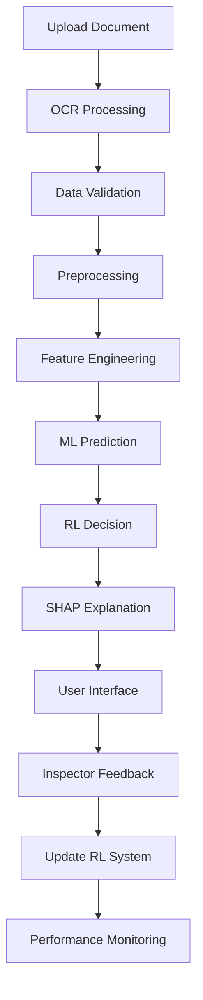
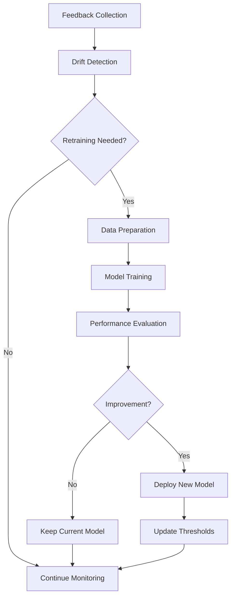

# CHAPITRE 3 : ANALYSE ET CONCEPTION DU SYSTÈME

## 3.1 Analyse des Besoins Métier

### 3.1.1 Identification des Acteurs

**Acteurs principaux :**

**1. Inspecteur des Douanes :**
- **Rôle** : Analyse des déclarations, prise de décision de contrôle
- **Besoins** : Interface simple, explications claires, workflow optimisé
- **Contraintes** : Temps limité, expertise variable, charge de travail élevée
- **Objectifs** : Détection efficace des fraudes, justification des décisions

**2. Expert Machine Learning :**
- **Rôle** : Gestion des modèles, monitoring des performances, optimisation
- **Besoins** : Dashboards détaillés, métriques de performance, outils d'analyse
- **Contraintes** : Expertise technique requise, maintenance continue
- **Objectifs** : Optimisation des modèles, détection de drift, amélioration continue

**3. Chef de Service :**
- **Rôle** : Supervision, reporting, prise de décision stratégique
- **Besoins** : Vue d'ensemble, statistiques agrégées, rapports de performance
- **Contraintes** : Temps limité, besoin de synthèse, décisions stratégiques
- **Objectifs** : Optimisation des ressources, amélioration de l'efficacité

**Acteurs secondaires :**

**4. Déclarant/Importateur :**
- **Rôle** : Soumission des déclarations, respect des procédures
- **Besoins** : Processus simplifié, transparence, délais réduits
- **Contraintes** : Conformité réglementaire, coûts, délais
- **Objectifs** : Déclaration rapide et sans erreur

**5. Administrateur Système :**
- **Rôle** : Maintenance technique, sécurité, performance
- **Besoins** : Monitoring système, logs, alertes, sauvegardes
- **Contraintes** : Disponibilité 24/7, sécurité, performance
- **Objectifs** : Système stable et performant

### 3.1.2 Analyse des Processus Métier

**Processus actuel (AS-IS) :**

```
1. Réception déclaration → 2. Saisie manuelle → 3. Validation règles → 4. Contrôle aléatoire → 5. Décision
```

**Problèmes identifiés :**
- **Saisie manuelle** : Erreurs, délais, coûts
- **Volume important** : Plus de 487,230 déclarations à traiter
- **Validation limitée** : Règles fixes, pas d'adaptation
- **Contrôle aléatoire** : Inefficacité, ressources gaspillées
- **Décision subjective** : Variabilité, manque de traçabilité

**Processus cible (TO-BE) avec INSPECT_IA :**

```
1. Upload document → 2. OCR automatique → 3. Preprocessing avancé → 4. Prédiction ML-RL → 5. Explication SHAP → 6. Décision assistée
```

**Améliorations apportées :**
- **OCR automatique** : Extraction automatique des données
- **Preprocessing avancé** : Techniques de la cellule de ciblage
- **Prédiction intelligente** : Modèles ML optimisés + RL adaptatif
- **Explication garantie** : SHAP pour la transparence
- **Décision assistée** : Recommandations avec justifications

### 3.1.3 Spécification des Besoins Fonctionnels

**Besoins fonctionnels prioritaires :**

**1. Traitement des Documents :**
- **Upload multi-format** : CSV, PDF, Images
- **OCR intelligent** : Extraction automatique des champs
- **Validation des données** : Cohérence et complétude
- **Mapping intelligent** : Adaptation aux différents formats

**2. Prédiction de Fraude :**
- **Modèles ML optimisés** : XGBoost, LightGBM, CatBoost par chapitre
- **Système RL adaptatif** : Optimisation continue des seuils
- **Intégration SHAP** : Explicabilité des décisions
- **Seuils optimaux** : Calculés pour maximiser le F1-score

**3. Interface Utilisateur :**
- **Multi-rôles** : Inspecteur, Expert ML, Chef de Service
- **Dashboard temps réel** : Métriques de performance
- **Workflow optimisé** : Processus de décision assistée
- **Explications visuelles** : Graphiques SHAP, importance des features

**4. Monitoring et Analytics :**
- **Détection de drift** : Surveillance des changements de distribution
- **Métriques de performance** : F1, AUC, Precision, Recall
- **Alertes intelligentes** : Recommandations d'entraînement
- **Historique des décisions** : Traçabilité complète

### 3.1.4 Spécification des Besoins Non-Fonctionnels

**Performance :**
- **Temps de réponse** : < 2 secondes pour l'analyse complète
- **Débit** : > 1000 déclarations/heure
- **Disponibilité** : 99.9% (8h de maintenance/mois)
- **Scalabilité** : Support de 10,000+ utilisateurs simultanés

**Sécurité :**
- **Authentification** : Multi-facteurs, SSO
- **Autorisation** : Contrôle d'accès basé sur les rôles (RBAC)
- **Chiffrement** : TLS 1.3, chiffrement des données sensibles
- **Audit** : Logs de sécurité, traçabilité des actions

**Fiabilité :**
- **Résilience** : Tolérance aux pannes, redondance
- **Sauvegarde** : Backup automatique quotidien
- **Récupération** : RTO < 4h, RPO < 1h
- **Monitoring** : Surveillance proactive 24/7

**Maintenabilité :**
- **Architecture modulaire** : Composants découplés
- **Documentation** : Code documenté, API documentée
- **Tests** : Couverture > 80%, tests automatisés
- **Déploiement** : CI/CD, déploiement sans interruption

## 3.2 Architecture Fonctionnelle INSPECT_IA

### 3.2.1 Vue d'Ensemble de l'Architecture

**Architecture en couches :**

```
┌─────────────────────────────────────────────────────────────┐
│                    COUCHE PRÉSENTATION                     │
│  ┌─────────────┐ ┌─────────────┐ ┌─────────────┐          │
│  │ Inspecteur  │ │ Expert ML   │ │ Chef Service│          │
│  │ (Flutter)   │ │ (Flutter)   │ │ (Flutter)   │          │
│  └─────────────┘ └─────────────┘ └─────────────┘          │
└─────────────────────────────────────────────────────────────┘
┌─────────────────────────────────────────────────────────────┐
│                    COUCHE API REST                         │
│  ┌─────────────┐ ┌─────────────┐ ┌─────────────┐          │
│  │ FastAPI     │ │ Validation  │ │ Authentif.  │          │
│  │ Endpoints   │ │ Données     │ │ Autorisation│          │
│  └─────────────┘ └─────────────┘ └─────────────┘          │
└─────────────────────────────────────────────────────────────┘
┌─────────────────────────────────────────────────────────────┐
│                    COUCHE MÉTIER                           │
│  ┌─────────────┐ ┌─────────────┐ ┌─────────────┐          │
│  │ OCR Pipeline│ │ ML Models   │ │ RL System   │          │
│  │ Preprocessing│ │ SHAP        │ │ Retraining  │          │
│  └─────────────┘ └─────────────┘ └─────────────┘          │
└─────────────────────────────────────────────────────────────┘
┌─────────────────────────────────────────────────────────────┐
│                    COUCHE DONNÉES                          │
│  ┌─────────────┐ ┌─────────────┐ ┌─────────────┐          │
│  │ PostgreSQL  │ │ Redis Cache │ │ File Storage│          │
│  │ (Données)   │ │ (Sessions)  │ │ (Modèles)   │          │
│  └─────────────┘ └─────────────┘ └─────────────┘          │
└─────────────────────────────────────────────────────────────┘
```

### 3.2.2 Composants Principaux

**1. Pipeline OCR et Preprocessing :**

```python
class OCRPipeline:
    def process_document(self, file_path: str, chapter: str) -> Dict[str, Any]:
        """Pipeline complet de traitement des documents"""
        
        # 1. Détection du type de fichier
        file_type = self.detect_file_type(file_path)
        
        # 2. Extraction des données
        if file_type == "csv":
            data = self.process_csv(file_path)
        elif file_type == "pdf":
            data = self.process_pdf(file_path)
        elif file_type == "image":
            data = self.process_image(file_path)
        
        # 3. Preprocessing avancé
        processed_data = self.advanced_preprocessing(data, chapter)
        
        # 4. Validation et normalisation
        validated_data = self.validate_and_normalize(processed_data)
        
        return validated_data
```

**2. Système ML-RL Hybride :**

```python
class MLRLHybridSystem:
    def __init__(self, chapter: str):
        self.ml_model = self.load_ml_model(chapter)
        self.rl_manager = self.load_rl_manager(chapter)
        self.shap_explainer = self.load_shap_explainer(chapter)
    
    def predict_with_explanation(self, data: Dict[str, Any]) -> Dict[str, Any]:
        """Prédiction avec explication SHAP"""
        
        # 1. Prédiction ML
        ml_probability = self.ml_model.predict_proba(data)[0][1]
        
        # 2. Décision RL
        rl_decision = self.rl_manager.predict(data, ml_probability)
        
        # 3. Explication SHAP
        shap_values = self.shap_explainer.shap_values(data)
        
        return {
            'ml_probability': ml_probability,
            'rl_decision': rl_decision,
            'shap_explanation': shap_values,
            'confidence_score': self.calculate_confidence(ml_probability, rl_decision)
        }
```

**3. Système de Retraining Automatique :**

```python
class AutoRetrainingSystem:
    def should_retrain(self, chapter: str) -> bool:
        """Détermine si un modèle doit être retraîné"""
        
        # Conditions de retraining
        conditions = [
            self.check_time_interval(chapter),  # 30 jours
            self.check_feedback_count(chapter),  # 100 nouveaux feedbacks
            self.check_performance_degradation(chapter),  # F1 < 0.95
            self.check_drift_detection(chapter)  # Drift significatif
        ]
        
        return any(conditions)
    
    def retrain_model(self, chapter: str):
        """Retraining automatique du modèle"""
        
        # 1. Charger les données existantes
        existing_data = self.load_training_data(chapter)
        
        # 2. Récupérer les nouveaux feedbacks
        new_feedbacks = self.get_new_feedbacks(chapter)
        
        # 3. Combiner et retraîner
        combined_data = self.combine_data(existing_data, new_feedbacks)
        new_model = self.train_model(combined_data, chapter)
        
        # 4. Évaluer et sauvegarder si amélioration
        if self.evaluate_improvement(new_model, chapter):
            self.save_model(new_model, chapter)
            self.update_thresholds(chapter)
```

### 3.2.3 Flux de Données

**Flux principal de prédiction :**

```
1. Upload Document
   ↓
2. OCR Extraction
   ↓
3. Preprocessing Avancé
   ↓
4. Feature Engineering
   ↓
5. Prédiction ML
   ↓
6. Décision RL
   ↓
7. Explication SHAP
   ↓
8. Interface Utilisateur
```

**Flux de feedback et apprentissage :**

```
1. Décision Inspecteur
   ↓
2. Feedback Collection
   ↓
3. Drift Detection
   ↓
4. Retraining Decision
   ↓
5. Model Update
   ↓
6. Performance Monitoring
```

## 3.3 Modélisation des Données et Processus

### 3.3.1 Modèle de Données

**Entités principales :**

```sql
-- Table des déclarations
CREATE TABLE declarations (
    declaration_id VARCHAR(50) PRIMARY KEY,
    chapter VARCHAR(10) NOT NULL,
    annee INTEGER,
    bureau VARCHAR(10),
    numero VARCHAR(20),
    valeur_caf DECIMAL(15,2),
    poids_net DECIMAL(10,3),
    pays_origine VARCHAR(3),
    code_produit VARCHAR(10),
    created_at TIMESTAMP DEFAULT CURRENT_TIMESTAMP
);

-- Table des prédictions
CREATE TABLE predictions (
    prediction_id SERIAL PRIMARY KEY,
    declaration_id VARCHAR(50) REFERENCES declarations(declaration_id),
    ml_probability DECIMAL(5,4),
    rl_decision VARCHAR(20),
    confidence_score DECIMAL(5,4),
    shap_values JSONB,
    created_at TIMESTAMP DEFAULT CURRENT_TIMESTAMP
);

-- Table des feedbacks
CREATE TABLE advanced_feedbacks (
    feedback_id SERIAL PRIMARY KEY,
    declaration_id VARCHAR(50) REFERENCES declarations(declaration_id),
    inspector_id VARCHAR(50),
    feedback_type VARCHAR(20), -- 'correct', 'incorrect', 'uncertain'
    feedback_quality INTEGER, -- 1-5
    comments TEXT,
    created_at TIMESTAMP DEFAULT CURRENT_TIMESTAMP
);

-- Table des profils d'inspecteurs
CREATE TABLE inspector_profiles (
    inspector_id VARCHAR(50) PRIMARY KEY,
    experience_years INTEGER,
    specialization VARCHAR(50),
    accuracy_rate DECIMAL(5,4),
    total_decisions INTEGER,
    last_updated TIMESTAMP DEFAULT CURRENT_TIMESTAMP
);
```

### 3.3.2 Modèle de Processus

**Processus de prédiction :**



**Processus de retraining :**



## 3.4 Conception des Modèles ML/RL

### 3.4.1 Architecture des Modèles ML

**Pipeline de preprocessing :**

```python
class PreprocessingPipeline:
    def __init__(self, chapter: str):
        self.chapter = chapter
        self.numeric_transformer = Pipeline([
            ('imputer', SimpleImputer(strategy='median')),
            ('scaler', StandardScaler())
        ])
        self.categorical_transformer = Pipeline([
            ('imputer', SimpleImputer(strategy='constant', fill_value='unknown')),
            ('onehot', OneHotEncoder(handle_unknown='ignore'))
        ])
    
    def create_preprocessor(self, X: pd.DataFrame) -> ColumnTransformer:
        """Création du préprocesseur adapté au chapitre"""
        
        numeric_features = self.get_numeric_features()
        categorical_features = self.get_categorical_features()
        
        preprocessor = ColumnTransformer(
            transformers=[
                ('num', self.numeric_transformer, numeric_features),
                ('cat', self.categorical_transformer, categorical_features)
            ]
        )
        
        return preprocessor
```

**Modèles ML optimisés :**

```python
class OptimizedMLModels:
    def __init__(self, chapter: str):
        self.chapter = chapter
        self.models = {
            'xgboost': XGBClassifier(
                n_estimators=100,
                max_depth=6,
                learning_rate=0.1,
                random_state=42,
                eval_metric='logloss'
            ),
            'lightgbm': LGBMClassifier(
                n_estimators=100,
                max_depth=6,
                learning_rate=0.1,
                random_state=42,
                class_weight='balanced'
            ),
            'catboost': CatBoostClassifier(
                iterations=100,
                depth=6,
                learning_rate=0.1,
                random_seed=42,
                verbose=False
            )
        }
    
    def train_models(self, X_train, y_train, X_val, y_val):
        """Entraînement des modèles avec validation"""
        
        results = {}
        for name, model in self.models.items():
            # Création du pipeline complet
            pipeline = Pipeline([
                ('preprocessor', self.create_preprocessor(X_train)),
                ('classifier', model)
            ])
            
            # Entraînement
            pipeline.fit(X_train, y_train)
            
            # Évaluation
            y_pred = pipeline.predict(X_val)
            y_pred_proba = pipeline.predict_proba(X_val)[:, 1]
            
            results[name] = {
                'model': pipeline,
                'f1_score': f1_score(y_val, y_pred),
                'auc_score': roc_auc_score(y_val, y_pred_proba),
                'precision': precision_score(y_val, y_pred),
                'recall': recall_score(y_val, y_pred)
            }
        
        return results
```

### 3.4.2 Architecture du Système RL

**Gestionnaire RL avancé :**

```python
class AdvancedRLManager:
    def __init__(self, chapter: str, level: str = "expert"):
        self.chapter = chapter
        self.level = level
        self.bandit = AdvancedEpsilonGreedyBandit(
            epsilon=0.1,
            strategy="hybrid"
        )
        self.context_store = AdvancedRLStore()
        self.inspector_profiles = {}
    
    def predict(self, context: Dict[str, Any], ml_probability: float) -> Dict[str, Any]:
        """Prédiction RL avec contexte enrichi"""
        
        # 1. Génération de la clé contextuelle
        context_key = self.generate_context_key(context)
        
        # 2. Récupération des statistiques contextuelles
        context_stats = self.context_store.get_context_stats(context_key)
        
        # 3. Prédiction du bandit
        action, exploration_used = self.bandit.predict(
            context_stats, ml_probability
        )
        
        # 4. Calcul du score de confiance
        confidence = self.calculate_confidence(
            ml_probability, context_stats, exploration_used
        )
        
        return {
            'action': action,
            'confidence': confidence,
            'exploration_used': exploration_used,
            'context_key': context_key
        }
    
    def add_feedback(self, context_key: str, action: str, reward: float, inspector_id: str):
        """Ajout de feedback et mise à jour du système"""
        
        # 1. Mise à jour du bandit
        self.bandit.update(context_key, action, reward)
        
        # 2. Mise à jour du profil inspecteur
        self.update_inspector_profile(inspector_id, action, reward)
        
        # 3. Vérification du retraining
        if self.should_trigger_retraining():
            self.trigger_ml_retraining()
```

**Algorithme de bandit multi-bras :**

```python
class AdvancedEpsilonGreedyBandit:
    def __init__(self, epsilon: float = 0.1, strategy: str = "hybrid"):
        self.epsilon = epsilon
        self.strategy = strategy
        self.arm_stats = defaultdict(lambda: {
            'count': 0,
            'total_reward': 0.0,
            'average_reward': 0.0,
            'confidence_interval': 0.0
        })
    
    def predict(self, context_stats: Dict, ml_probability: float) -> Tuple[str, bool]:
        """Prédiction avec exploration/exploitation"""
        
        if random.random() < self.epsilon:
            # Exploration
            action = self.explore(context_stats)
            exploration_used = True
        else:
            # Exploitation
            action = self.exploit(context_stats, ml_probability)
            exploration_used = False
        
        return action, exploration_used
    
    def exploit(self, context_stats: Dict, ml_probability: float) -> str:
        """Exploitation basée sur les statistiques et probabilité ML"""
        
        # Combinaison des statistiques RL et probabilité ML
        combined_score = self.combine_scores(context_stats, ml_probability)
        
        if combined_score > 0.7:
            return "fraude"
        elif combined_score < 0.3:
            return "conforme"
        else:
            return "zone_grise"
```

## 3.5 Architecture Technique et Choix Technologiques

### 3.5.1 Stack Technologique

**Backend :**
- **Framework** : FastAPI (Python 3.9+)
- **Base de données** : PostgreSQL 14+
- **Cache** : Redis 6+
- **Queue** : Celery avec Redis
- **ML Libraries** : scikit-learn, XGBoost, LightGBM, CatBoost
- **RL Libraries** : Custom implementation
- **Explicabilité** : SHAP, LIME

**Frontend :**
- **Framework** : Flutter 3.x avec Dart
- **Architecture** : StatefulWidget avec ChangeNotifier
- **Navigation** : Named routes avec gestion des permissions par rôle
- **Services** : CompleteBackendService (98 endpoints backend centralisés)
- **État** : Gestion locale + rafraîchissement automatique (30s)
- **UI Components** : Material Design 3 avec design system institutionnel
- **Communication** : HTTP multipart avec sauvegarde PostgreSQL
- **Authentification** : Multi-rôles (Inspecteur, Expert ML, Chef de Service)

**Infrastructure :**
- **Containerisation** : Docker, Docker Compose
- **Orchestration** : Kubernetes (optionnel)
- **Monitoring** : Prometheus, Grafana
- **Logging** : ELK Stack (Elasticsearch, Logstash, Kibana)
- **CI/CD** : GitHub Actions

### 3.5.3 Architecture de Déploiement

**Environnement de développement :**
```
┌─────────────────┐    ┌─────────────────┐    ┌─────────────────┐
│   Flutter App   │    │   FastAPI       │    │   PostgreSQL    │
│   (Local)       │◄──►│   (Local)       │◄──►│   (Local)       │
└─────────────────┘    └─────────────────┘    └─────────────────┘
```

**Environnement de production :**
```
┌─────────────────┐    ┌─────────────────┐    ┌─────────────────┐
│   Load Balancer │    │   FastAPI       │    │   PostgreSQL    │
│   (Nginx)       │◄──►│   (Multiple     │◄──►│   (Primary +    │
│                 │    │   Instances)    │    │   Replica)      │
└─────────────────┘    └─────────────────┘    └─────────────────┘
                              │
                              ▼
                       ┌─────────────────┐
                       │   Redis Cache   │
                       │   (Cluster)     │
                       └─────────────────┘
```

### 3.5.4 Sécurité et Performance

**Sécurité :**
- **Authentification** : JWT avec refresh tokens
- **Autorisation** : RBAC (Role-Based Access Control)
- **Chiffrement** : TLS 1.3, AES-256 pour les données sensibles
- **Validation** : Pydantic pour la validation des données
- **Rate Limiting** : Protection contre les attaques DDoS

**Performance :**
- **Cache** : Redis pour les sessions et données fréquentes
- **Optimisation DB** : Index, requêtes optimisées, connection pooling
- **Async/Await** : FastAPI pour la concurrence
- **CDN** : Distribution des assets statiques
- **Monitoring** : Métriques de performance en temps réel
- **Contrôles aléatoires** : Inefficacité, manque de ciblage
- **Décisions subjectives** : Incohérence, difficulté de justification
- **Pas de feedback** : Amélioration limitée

**Processus cible (TO-BE) :**

```
1. Upload document → 2. OCR automatique → 3. Extraction features → 4. Prédiction ML → 5. Explication SHAP → 6. Décision assistée → 7. Feedback → 8. Amélioration continue
```

**Améliorations apportées :**
- **Automatisation** : OCR et extraction automatiques
- **Intelligence** : Prédiction ML avec explications
- **Ciblage** : Contrôles basés sur le risque
- **Apprentissage** : Feedback et amélioration continue

### 3.1.3 Spécification des Besoins Fonctionnels

**Besoins fonctionnels principaux :**

**RF001 - Gestion des Déclarations :**
- RF001.1 : Upload de documents (PDF, images, formulaires)
- RF001.2 : OCR automatique avec correction d'erreurs
- RF001.3 : Extraction automatique des champs
- RF001.4 : Validation et normalisation des données
- RF001.5 : Stockage sécurisé des déclarations

**RF002 - Prédiction de Fraude :**
- RF002.1 : Prédiction ML par chapitre tarifaire
- RF002.2 : Calcul de probabilité de fraude
- RF002.3 : Classification (conforme/suspect/fraude)
- RF002.4 : Application des seuils RL adaptatifs
- RF002.5 : Historique des prédictions

**RF003 - Explicabilité :**
- RF003.1 : Calcul des valeurs SHAP
- RF003.2 : Explication des décisions
- RF003.3 : Identification des features importantes
- RF003.4 : Visualisation des explications
- RF003.5 : Export des rapports d'explication

**RF004 - Interface Utilisateur :**
- RF004.1 : Interface adaptée par rôle
- RF004.2 : Dashboards temps réel
- RF004.3 : Gestion des alertes
- RF004.4 : Rapports et statistiques
- RF004.5 : Recherche et filtrage

**RF005 - Gestion des Modèles :**
- RF005.1 : Entraînement des modèles ML
- RF005.2 : Monitoring des performances
- RF005.3 : Détection de drift
- RF005.4 : Retraining automatique
- RF005.5 : Gestion des versions

### 3.1.4 Spécification des Besoins Non-Fonctionnels

**Performance :**
- **Temps de réponse** : < 5 secondes pour une prédiction complète
- **Débit** : 1000 déclarations/heure minimum
- **Disponibilité** : 99.5% uptime
- **Scalabilité** : Support de 10,000 utilisateurs simultanés

**Sécurité :**
- **Authentification** : Multi-facteurs obligatoire
- **Autorisation** : Contrôle d'accès basé sur les rôles
- **Chiffrement** : Données chiffrées en transit et au repos
- **Audit** : Traçabilité complète des actions

**Fiabilité :**
- **Résilience** : Tolérance aux pannes
- **Sauvegarde** : Sauvegarde automatique quotidienne
- **Récupération** : RTO < 4 heures, RPO < 1 heure
- **Monitoring** : Surveillance continue 24/7

**Maintenabilité :**
- **Modularité** : Architecture modulaire et extensible
- **Documentation** : Documentation technique complète
- **Tests** : Couverture de tests > 80%
- **Déploiement** : Déploiement automatisé

## 3.2 Architecture Fonctionnelle INSPECT_IA

### 3.2.1 Vue d'Ensemble de l'Architecture

```
┌─────────────────────────────────────────────────────────────────┐
│                        INSPECT_IA SYSTEM                        │
├─────────────────────────────────────────────────────────────────┤
│  FRONTEND LAYER (Flutter)                                      │
│  ┌─────────────┐ ┌─────────────┐ ┌─────────────┐              │
│  │ Inspecteur  │ │ Expert ML   │ │ Chef Service│              │
│  │ Interface   │ │ Dashboard   │ │ Dashboard   │              │
│  └─────────────┘ └─────────────┘ └─────────────┘              │
├─────────────────────────────────────────────────────────────────┤
│  API GATEWAY LAYER                                             │
│  ┌─────────────┐ ┌─────────────┐ ┌─────────────┐              │
│  │ Auth        │ │ Rate        │ │ Load        │              │
│  │ Service     │ │ Limiting    │ │ Balancing   │              │
│  └─────────────┘ └─────────────┘ └─────────────┘              │
├─────────────────────────────────────────────────────────────────┤
│  BUSINESS LOGIC LAYER (FastAPI)                                │
│  ┌─────────────┐ ┌─────────────┐ ┌─────────────┐              │
│  │ Upload      │ │ ML Engine   │ │ RL Engine   │              │
│  │ Service     │ │ Service     │ │ Service     │              │
│  └─────────────┘ └─────────────┘ └─────────────┘              │
│  ┌─────────────┐ ┌─────────────┐ ┌─────────────┐              │
│  │ SHAP        │ │ Analytics   │ │ Monitoring  │              │
│  │ Service     │ │ Service     │ │ Service     │              │
│  └─────────────┘ └─────────────┘ └─────────────┘              │
├─────────────────────────────────────────────────────────────────┤
│  DATA LAYER (PostgreSQL)                                       │
│  ┌─────────────┐ ┌─────────────┐ ┌─────────────┐              │
│  │ Declarations│ │ Predictions │ │ Features    │              │
│  │ Tables      │ │ Tables      │ │ Tables      │              │
│  └─────────────┘ └─────────────┘ └─────────────┘              │
└─────────────────────────────────────────────────────────────────┘
```

### 3.2.4 Architecture Frontend (Flutter)

**Architecture technique :**
- **Framework** : Flutter 3.x avec Dart
- **Pattern** : StatefulWidget avec ChangeNotifier
- **Navigation** : Named routes avec gestion des permissions par rôle
- **Services** : CompleteBackendService (98 endpoints backend centralisés)
- **État** : Gestion locale + rafraîchissement automatique (30s)

**Écrans par rôle :**

**Inspecteur (`inspecteur`) :**
- **Pages** : `/home`, `/upload`, `/analysis`, `/pv`, `/feedback`, `/pv-list`, `/pv-detail`
- **Fonctionnalités** : Upload multi-formats, analyse avec SHAP, feedback, génération PV
- **Permissions** : Upload documents, voir prédictions, générer PV, fournir feedback, voir analytics de fraude

**Expert ML (`expert_ml`) :**
- **Pages** : Toutes pages Inspecteur + `/rl-performance`, `/rl-analytics`, `/backend-test`, `/ml-dashboard`, `/postgresql-test`
- **Fonctionnalités** : Surveillance avancée des modèles, analytics RL, retraining, diagnostic système
- **Permissions** : Toutes permissions Inspecteur + surveillance ML/RL, configuration modèles, gestion seuils, monitoring drift

**Chef de Service (`chef_service`) :**
- **Pages** : `/dashboard`, `/analysis`, `/backend-test`, `/postgresql-test`
- **Fonctionnalités** : Supervision globale, analytics de performance, gestion des équipes
- **Permissions** : Vue d'ensemble, analytics globales, KPIs, gestion alertes, export rapports

**Services et Communication :**
- **CompleteBackendService** : Service unifié pour 98 endpoints backend
  - Router Principal (/predict) : 84 endpoints
  - ML Router (/ml) : 7 endpoints
  - PostgreSQL Router (/api/v2) : 7 endpoints
- **UserSessionService** : Gestion des sessions et permissions
- **Upload avec sauvegarde PostgreSQL** : Support multipart avec persistance
- **Gestion d'erreurs** : Retry automatique et messages contextuels

**Design System :**
- **Couleurs institutionnelles** : Vert douanes, Jaune doré, Rouge discret, Bleu nuit
- **Couleurs par chapitre** : Bleu pharmaceutique, Marron machines, Gris-bleu électrique
- **Configuration centralisée** : AppConfig avec vraies métriques des modèles

**2. API Gateway :**
- **Authentification** : JWT tokens, refresh tokens
- **Autorisation** : RBAC (Role-Based Access Control)
- **Rate Limiting** : Protection contre les abus
- **Load Balancing** : Distribution de charge
- **Monitoring** : Logs, métriques, alertes

**3. Business Logic Layer :**
- **Upload Service** : Gestion des fichiers, OCR, validation
- **ML Engine** : Modèles XGBoost, CatBoost, prédictions
- **RL Engine** : Optimisation des seuils, apprentissage
- **SHAP Service** : Calcul des explications, interprétabilité
- **Analytics Service** : Statistiques, rapports, KPI
- **Monitoring Service** : Surveillance, alertes, maintenance

**4. Data Layer :**
- **Declarations** : Stockage des données de base
- **Predictions** : Historique des prédictions
- **Features** : Features extraites et calculées
- **Users** : Gestion des utilisateurs et rôles
- **Feedback** : Retours d'expérience et amélioration

### 3.2.3 Flux de Données

**Flux principal de prédiction :**

```
1. Upload Document → 2. OCR Processing → 3. Feature Extraction → 4. ML Prediction → 5. SHAP Explanation → 6. RL Threshold → 7. Final Decision → 8. Storage → 9. User Interface
```

**Flux de feedback :**

```
1. User Decision → 2. Feedback Collection → 3. RL Learning → 4. Model Update → 5. Performance Monitoring
```

**Flux de monitoring :**

```
1. System Metrics → 2. Performance Data → 3. Drift Detection → 4. Alert Generation → 5. Dashboard Update
```

## 3.3 Modélisation des Données et Processus

### 3.3.1 Modèle de Données Conceptuel

**Entités principales :**

**Declaration :**
- **Identifiants** : declaration_id, numero_declaration
- **Données de base** : date_declaration, type_declaration, bureau_douane
- **Informations importateur** : nom_importateur, adresse, telephone
- **Informations marchandises** : description, quantite, valeur, pays_origine
- **Classification** : code_sh, chapitre_tarifaire, taux_droits
- **Métadonnées** : created_at, updated_at, status

**Prediction :**
- **Identifiants** : prediction_id, declaration_id
- **Résultats ML** : fraud_probability, predicted_class, confidence_score
- **Seuils RL** : threshold_used, rl_decision
- **Métadonnées** : model_version, created_at, processing_time

**Feature :**
- **Identifiants** : feature_id, prediction_id
- **Données** : feature_name, feature_value, feature_type
- **SHAP** : shap_value, shap_importance, feature_impact
- **Métadonnées** : created_at, feature_source

**User :**
- **Identifiants** : user_id, username, email
- **Profil** : role, permissions, profile_data
- **Sécurité** : password_hash, last_login, failed_attempts
- **Métadonnées** : created_at, updated_at, status

**Feedback :**
- **Identifiants** : feedback_id, prediction_id, user_id
- **Données** : user_decision, confidence_level, comments
- **Évaluation** : accuracy_rating, usefulness_rating
- **Métadonnées** : created_at, feedback_type

### 3.3.2 Modèle de Données Logique

**Schéma de base de données PostgreSQL :**

```sql
-- Table des déclarations
CREATE TABLE declarations (
    declaration_id SERIAL PRIMARY KEY,
    numero_declaration VARCHAR(50) UNIQUE NOT NULL,
    date_declaration DATE NOT NULL,
    type_declaration VARCHAR(20) NOT NULL,
    bureau_douane VARCHAR(50) NOT NULL,
    nom_importateur VARCHAR(200) NOT NULL,
    adresse_importateur TEXT,
    telephone_importateur VARCHAR(20),
    description_marchandises TEXT NOT NULL,
    quantite DECIMAL(15,3) NOT NULL,
    valeur_declaree DECIMAL(15,2) NOT NULL,
    pays_origine VARCHAR(50) NOT NULL,
    code_sh VARCHAR(10) NOT NULL,
    chapitre_tarifaire VARCHAR(3) NOT NULL,
    taux_droits DECIMAL(5,2),
    created_at TIMESTAMP DEFAULT CURRENT_TIMESTAMP,
    updated_at TIMESTAMP DEFAULT CURRENT_TIMESTAMP,
    status VARCHAR(20) DEFAULT 'active'
);

-- Table des prédictions
CREATE TABLE predictions (
    prediction_id SERIAL PRIMARY KEY,
    declaration_id INTEGER REFERENCES declarations(declaration_id),
    model_name VARCHAR(50) NOT NULL,
    model_version VARCHAR(20) NOT NULL,
    fraud_probability DECIMAL(5,4) NOT NULL,
    predicted_class VARCHAR(20) NOT NULL,
    confidence_score DECIMAL(5,4) NOT NULL,
    threshold_used DECIMAL(5,4) NOT NULL,
    rl_decision VARCHAR(20) NOT NULL,
    processing_time_ms INTEGER,
    created_at TIMESTAMP DEFAULT CURRENT_TIMESTAMP
);

-- Table des features
CREATE TABLE features (
    feature_id SERIAL PRIMARY KEY,
    prediction_id INTEGER REFERENCES predictions(prediction_id),
    feature_name VARCHAR(100) NOT NULL,
    feature_value DECIMAL(15,6),
    feature_type VARCHAR(20) NOT NULL,
    shap_value DECIMAL(10,6),
    shap_importance DECIMAL(10,6),
    feature_impact VARCHAR(50),
    created_at TIMESTAMP DEFAULT CURRENT_TIMESTAMP
);

-- Table des utilisateurs
CREATE TABLE users (
    user_id SERIAL PRIMARY KEY,
    username VARCHAR(50) UNIQUE NOT NULL,
    email VARCHAR(100) UNIQUE NOT NULL,
    password_hash VARCHAR(255) NOT NULL,
    role VARCHAR(20) NOT NULL,
    permissions JSONB,
    profile_data JSONB,
    last_login TIMESTAMP,
    failed_attempts INTEGER DEFAULT 0,
    created_at TIMESTAMP DEFAULT CURRENT_TIMESTAMP,
    updated_at TIMESTAMP DEFAULT CURRENT_TIMESTAMP,
    status VARCHAR(20) DEFAULT 'active'
);

-- Table des feedbacks
CREATE TABLE feedbacks (
    feedback_id SERIAL PRIMARY KEY,
    prediction_id INTEGER REFERENCES predictions(prediction_id),
    user_id INTEGER REFERENCES users(user_id),
    user_decision VARCHAR(20) NOT NULL,
    confidence_level INTEGER CHECK (confidence_level BETWEEN 1 AND 5),
    comments TEXT,
    accuracy_rating INTEGER CHECK (accuracy_rating BETWEEN 1 AND 5),
    usefulness_rating INTEGER CHECK (usefulness_rating BETWEEN 1 AND 5),
    created_at TIMESTAMP DEFAULT CURRENT_TIMESTAMP,
    feedback_type VARCHAR(20) DEFAULT 'user_feedback'
);
```

### 3.3.3 Relations et Contraintes

**Relations principales :**
- **Declaration → Prediction** : 1:N (une déclaration peut avoir plusieurs prédictions)
- **Prediction → Feature** : 1:N (une prédiction a plusieurs features)
- **User → Feedback** : 1:N (un utilisateur peut donner plusieurs feedbacks)
- **Prediction → Feedback** : 1:N (une prédiction peut recevoir plusieurs feedbacks)

**Contraintes d'intégrité :**
- **Clés étrangères** : Référentielle entre toutes les tables liées
- **Unicité** : Numéro de déclaration unique, username unique, email unique
- **Valeurs par défaut** : Timestamps automatiques, statuts par défaut
- **Contrôles** : Valeurs dans des plages acceptables, formats validés

**Index pour la performance :**
```sql
-- Index sur les colonnes fréquemment utilisées
CREATE INDEX idx_declarations_chapitre ON declarations(chapitre_tarifaire);
CREATE INDEX idx_declarations_date ON declarations(date_declaration);
CREATE INDEX idx_predictions_declaration ON predictions(declaration_id);
CREATE INDEX idx_predictions_created_at ON predictions(created_at);
CREATE INDEX idx_features_prediction ON features(prediction_id);
CREATE INDEX idx_users_role ON users(role);
CREATE INDEX idx_feedbacks_prediction ON feedbacks(prediction_id);
```

## 3.4 Conception des Modèles ML/RL

### 3.4.1 Architecture des Modèles ML

**Modèles par chapitre tarifaire :**

**Chapitre 30 (Médicaments) - CatBoost :**
```python
class CatBoostFraudDetector:
    def __init__(self):
        self.model = CatBoostClassifier(
            iterations=1000,
            learning_rate=0.1,
            depth=8,
            loss_function='Logloss',
            eval_metric='F1',
            random_seed=42,
            cat_features=['pays_origine', 'bureau_douane', 'type_declaration'],
            verbose=False
        )
    
    def get_features(self):
        return [
            # Features tarifaires
            'valeur_declaree', 'quantite', 'prix_unitaire',
            'taux_droits', 'code_sh_complet',
            
            # Features de cohérence
            'prix_vs_marche', 'quantite_vs_habituel',
            'pays_origine_risque', 'bureau_douane_risque',
            
            # Features de risque
            'importateur_risque', 'historique_fraude',
            'saisonnalite', 'tendance_prix'
        ]
```

**Chapitre 84 (Machines) - XGBoost :**
```python
class XGBoostFraudDetector:
    def __init__(self):
        self.model = XGBClassifier(
            n_estimators=1000,
            learning_rate=0.1,
            max_depth=8,
            subsample=0.8,
            colsample_bytree=0.8,
            random_state=42,
            eval_metric='logloss'
        )
    
    def get_features(self):
        return [
            # Features techniques
            'valeur_declaree', 'poids_net', 'poids_brut',
            'classification_technique', 'marque_modele',
            
            # Features de cohérence
            'valeur_vs_estimation', 'poids_vs_valeur',
            'marque_consistance', 'modele_consistance',
            
            # Features de risque
            'pays_origine_technologie', 'importateur_specialise',
            'historique_contrefacon', 'tendance_technologique'
        ]
```

**Chapitre 85 (Électronique) - XGBoost :**
```python
class XGBoostElectronicsDetector:
    def __init__(self):
        self.model = XGBClassifier(
            n_estimators=1000,
            learning_rate=0.1,
            max_depth=8,
            subsample=0.8,
            colsample_bytree=0.8,
            random_state=42,
            eval_metric='logloss'
        )
    
    def get_features(self):
        return [
            # Features électroniques
            'valeur_declaree', 'puissance', 'frequence',
            'technologie', 'generation', 'compatibilite',
            
            # Features de cohérence
            'prix_vs_technologie', 'puissance_vs_prix',
            'compatibilite_marche', 'generation_consistance',
            
            # Features de risque
            'contrefacon_risque', 'reexportation_risque',
            'marque_risque', 'pays_origine_risque'
        ]
```

### 3.4.2 Pipeline de Feature Engineering

**Extraction des features métier :**

```python
class BusinessFeatureExtractor:
    def __init__(self):
        self.market_data = MarketDataProvider()
        self.risk_database = RiskDatabase()
        self.historical_data = HistoricalDataProvider()
    
    def extract_tariff_features(self, declaration):
        features = {}
        
        # Prix unitaire
        features['prix_unitaire'] = declaration['valeur_declaree'] / declaration['quantite']
        
        # Comparaison avec le marché
        market_price = self.market_data.get_price(declaration['code_sh'])
        features['prix_vs_marche'] = features['prix_unitaire'] / market_price if market_price else 1.0
        
        # Taux de droits
        features['taux_droits'] = declaration.get('taux_droits', 0.0)
        
        return features
    
    def extract_consistency_features(self, declaration):
        features = {}
        
        # Cohérence pays-origine
        features['pays_origine_risque'] = self.risk_database.get_country_risk(
            declaration['pays_origine']
        )
        
        # Cohérence importateur
        features['importateur_risque'] = self.risk_database.get_importer_risk(
            declaration['nom_importateur']
        )
        
        # Historique de fraude
        features['historique_fraude'] = self.historical_data.get_fraud_history(
            declaration['nom_importateur']
        )
        
        return features
    
    def extract_risk_features(self, declaration):
        features = {}
        
        # Saisonnalité
        features['saisonnalite'] = self.calculate_seasonality(declaration)
        
        # Tendance des prix
        features['tendance_prix'] = self.calculate_price_trend(declaration)
        
        # Anomalies statistiques
        features['anomalie_statistique'] = self.detect_statistical_anomaly(declaration)
        
        return features
```

### 3.4.3 Système d'Apprentissage par Renforcement

**Environnement RL :**

```python
class FraudDetectionRLEnv:
    def __init__(self, ml_model, threshold_range=(0.1, 0.9)):
        self.ml_model = ml_model
        self.threshold_range = threshold_range
        self.current_threshold = 0.5
        self.performance_history = []
        self.feedback_history = []
        
    def get_state(self):
        """État actuel de l'environnement"""
        return {
            'current_threshold': self.current_threshold,
            'recent_performance': self.get_recent_performance(),
            'feedback_ratio': self.get_feedback_ratio(),
            'drift_score': self.get_drift_score(),
            'time_since_update': self.get_time_since_update()
        }
    
    def step(self, action):
        """Exécution d'une action (ajustement du seuil)"""
        # Action : ajustement du seuil (-1, 0, 1)
        threshold_adjustment = action * 0.05
        new_threshold = self.current_threshold + threshold_adjustment
        new_threshold = np.clip(new_threshold, *self.threshold_range)
        
        # Calcul de la récompense
        reward = self.calculate_reward(new_threshold)
        
        # Mise à jour de l'état
        self.current_threshold = new_threshold
        self.performance_history.append(reward)
        
        # État suivant
        next_state = self.get_state()
        done = self.is_episode_done()
        
        return next_state, reward, done, {}
    
    def calculate_reward(self, threshold):
        """Calcul de la récompense basée sur la performance"""
        # Performance ML avec le nouveau seuil
        ml_performance = self.ml_model.evaluate_with_threshold(threshold)
        
        # Feedback utilisateur récent
        user_feedback = self.get_recent_user_feedback()
        
        # Stabilité du seuil (éviter les oscillations)
        stability_penalty = -abs(threshold - 0.5) * 0.1
        
        # Récompense combinée
        reward = (
            ml_performance * 0.6 +      # Performance ML (60%)
            user_feedback * 0.3 +       # Feedback utilisateur (30%)
            stability_penalty           # Stabilité (10%)
        )
        
        return reward
```

**Agent Q-Learning :**

```python
class QLearningAgent:
    def __init__(self, state_size, action_size, learning_rate=0.1, gamma=0.95):
        self.state_size = state_size
        self.action_size = action_size
        self.learning_rate = learning_rate
        self.gamma = gamma
        
        # Table Q (état discretisé)
        self.q_table = np.zeros((state_size, action_size))
        
        # Paramètres d'exploration
        self.epsilon = 1.0
        self.epsilon_decay = 0.995
        self.epsilon_min = 0.01
        
        # Historique pour l'apprentissage
        self.memory = []
        self.batch_size = 32
    
    def act(self, state):
        """Sélection d'une action selon la politique ε-greedy"""
        if np.random.random() <= self.epsilon:
            return np.random.choice(self.action_size)
        return np.argmax(self.q_table[state])
    
    def learn(self, state, action, reward, next_state, done):
        """Apprentissage Q-Learning"""
        # Valeur Q actuelle
        current_q = self.q_table[state, action]
        
        # Valeur Q maximale pour l'état suivant
        next_max_q = np.max(self.q_table[next_state]) if not done else 0
        
        # Nouvelle valeur Q (équation de Bellman)
        new_q = current_q + self.learning_rate * (
            reward + self.gamma * next_max_q - current_q
        )
        
        # Mise à jour de la table Q
        self.q_table[state, action] = new_q
        
        # Décroissance de l'exploration
        if self.epsilon > self.epsilon_min:
            self.epsilon *= self.epsilon_decay
    
    def save_model(self, filepath):
        """Sauvegarde du modèle"""
        np.save(filepath, self.q_table)
    
    def load_model(self, filepath):
        """Chargement du modèle"""
        self.q_table = np.load(filepath)
```

### 3.4.4 Intégration SHAP pour l'Explicabilité

**Moteur SHAP :**

```python
class SHAPExplainer:
    def __init__(self, model, model_type='tree'):
        self.model = model
        self.model_type = model_type
        
        # Initialisation de l'explainer selon le type de modèle
        if model_type == 'tree':
            self.explainer = shap.TreeExplainer(model)
        elif model_type == 'linear':
            self.explainer = shap.LinearExplainer(model)
        else:
            self.explainer = shap.Explainer(model)
    
    def explain_prediction(self, X, feature_names=None):
        """Explication d'une prédiction individuelle"""
        # Calcul des valeurs SHAP
        shap_values = self.explainer.shap_values(X)
        
        # Si modèle binaire, prendre les valeurs pour la classe positive
        if len(shap_values.shape) > 1 and shap_values.shape[1] == 2:
            shap_values = shap_values[:, 1]
        
        # Calcul de l'importance des features
        feature_importance = np.abs(shap_values).argsort()[::-1]
        
        # Construction de l'explication
        explanation = {
            'prediction': self.model.predict_proba(X)[0],
            'shap_values': shap_values[0],
            'feature_importance': feature_importance,
            'top_features': self.get_top_features(shap_values[0], feature_names),
            'base_value': self.explainer.expected_value,
            'summary': self.generate_summary(shap_values[0], feature_names)
        }
        
        return explanation
    
    def get_top_features(self, shap_values, feature_names, top_k=10):
        """Extraction des features les plus importantes"""
        if feature_names is None:
            feature_names = [f'feature_{i}' for i in range(len(shap_values))]
        
        # Tri par importance (valeur absolue)
        importance_scores = np.abs(shap_values)
        top_indices = importance_scores.argsort()[-top_k:][::-1]
        
        top_features = []
        for i in top_indices:
            feature_info = {
                'name': feature_names[i],
                'shap_value': shap_values[i],
                'importance': importance_scores[i],
                'impact': self.get_impact_description(shap_values[i]),
                'direction': 'positive' if shap_values[i] > 0 else 'negative'
            }
            top_features.append(feature_info)
        
        return top_features
    
    def generate_summary(self, shap_values, feature_names):
        """Génération d'un résumé textuel de l'explication"""
        top_features = self.get_top_features(shap_values, feature_names, top_k=3)
        
        summary_parts = []
        for feature in top_features:
            if feature['importance'] > 0.1:  # Seuil d'importance
                impact = "augmente" if feature['direction'] == 'positive' else "diminue"
                summary_parts.append(
                    f"{feature['name']} {impact} la probabilité de fraude"
                )
        
        if summary_parts:
            return f"Décision basée principalement sur : {', '.join(summary_parts)}"
        else:
            return "Aucun facteur de risque significatif identifié"
    
    def get_impact_description(self, shap_value):
        """Description de l'impact d'une feature"""
        abs_value = abs(shap_value)
        if abs_value > 0.2:
            return "Impact très élevé"
        elif abs_value > 0.1:
            return "Impact élevé"
        elif abs_value > 0.05:
            return "Impact modéré"
        else:
            return "Impact faible"
```

## 3.5 Architecture Technique et Choix Technologiques

### 3.5.2 Stack Technologique Détaillé

**Backend :**
- **Framework** : FastAPI (Python 3.9+)
- **Base de données** : PostgreSQL 14+
- **Cache** : Redis 7+
- **Queue** : Celery avec Redis
- **Monitoring** : Prometheus + Grafana
- **Logs** : ELK Stack (Elasticsearch, Logstash, Kibana)

**Frontend :**
- **Framework** : Flutter 3.0+
- **État** : Provider pattern
- **Navigation** : Go Router
- **HTTP** : Dio
- **Local Storage** : Hive
- **Charts** : FL Chart

**Infrastructure :**
- **Conteneurisation** : Docker + Docker Compose
- **Orchestration** : Kubernetes (production)
- **CI/CD** : GitHub Actions
- **Monitoring** : Prometheus + Grafana
- **Logs** : ELK Stack

### 3.5.3 Architecture de Déploiement

**Environnement de développement :**
```
┌─────────────────┐    ┌─────────────────┐    ┌─────────────────┐
│   Flutter Dev   │    │   FastAPI Dev   │    │   PostgreSQL    │
│   (Hot Reload)  │◄──►│   (Debug Mode)  │◄──►│   (Local)       │
└─────────────────┘    └─────────────────┘    └─────────────────┘
```

**Environnement de production :**
```
┌─────────────────┐    ┌─────────────────┐    ┌─────────────────┐
│   Load Balancer │    │   App Servers   │    │   DB Cluster    │
│   (Nginx)       │◄──►│   (FastAPI)     │◄──►│   (PostgreSQL)  │
└─────────────────┘    └─────────────────┘    └─────────────────┘
         │                       │                       │
         ▼                       ▼                       ▼
┌─────────────────┐    ┌─────────────────┐    ┌─────────────────┐
│   CDN           │    │   Monitoring    │    │   Backup        │
│   (Static)      │    │   (Prometheus)  │    │   (Automated)   │
└─────────────────┘    └─────────────────┘    └─────────────────┘
```

### 3.5.4 Sécurité et Performance

**Sécurité :**
- **Authentification** : JWT avec refresh tokens
- **Autorisation** : RBAC avec permissions granulaires
- **Chiffrement** : TLS 1.3, AES-256 pour les données sensibles
- **Validation** : Validation stricte des entrées utilisateur
- **Audit** : Logs d'audit complets

**Performance :**
- **Cache** : Redis pour les données fréquemment accédées
- **Index** : Index optimisés sur PostgreSQL
- **Pagination** : Pagination pour les grandes listes
- **Compression** : Gzip pour les réponses API
- **CDN** : Distribution de contenu statique

**Scalabilité :**
- **Horizontal** : Scaling horizontal des serveurs d'application
- **Vertical** : Scaling vertical de la base de données
- **Load Balancing** : Distribution de charge intelligente
- **Auto-scaling** : Scaling automatique basé sur la charge

---

**Fin du Chapitre 3**