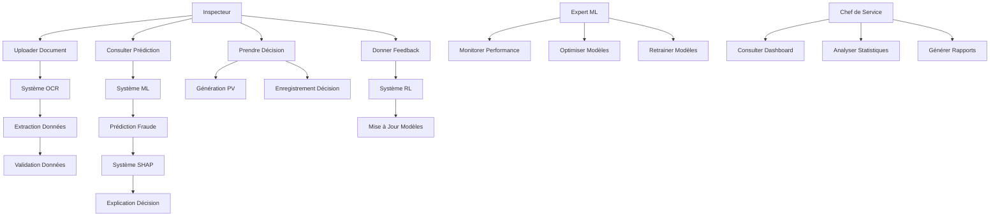
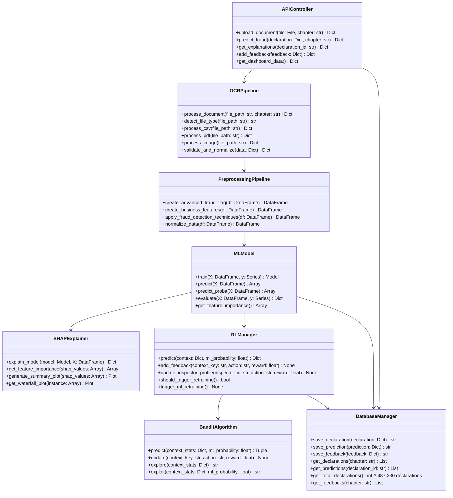
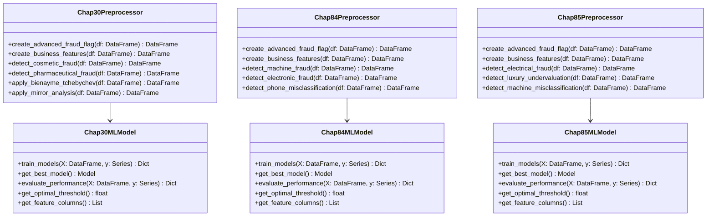
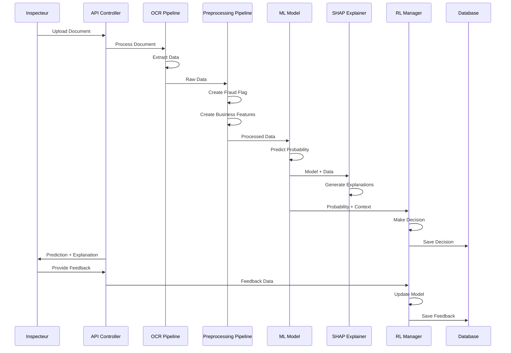
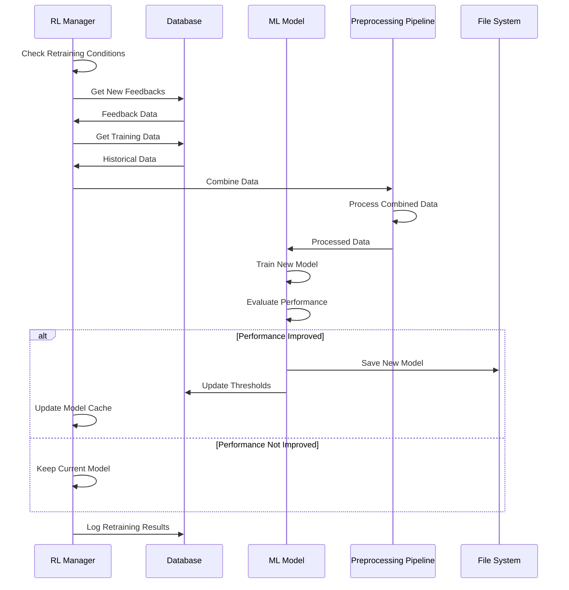
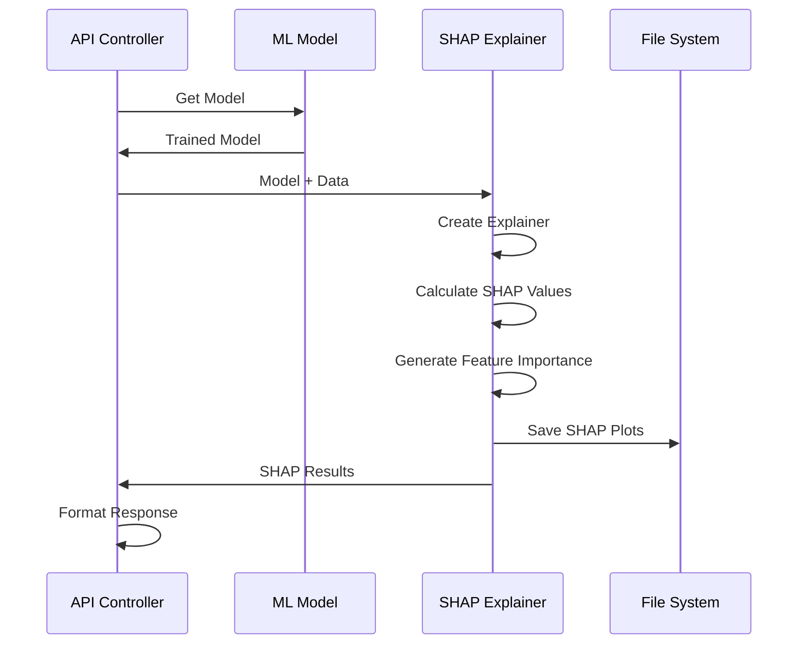
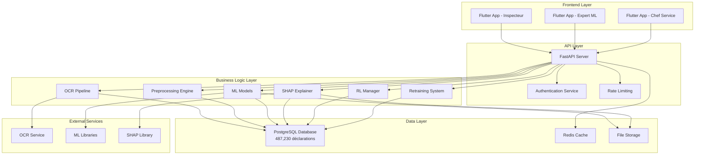
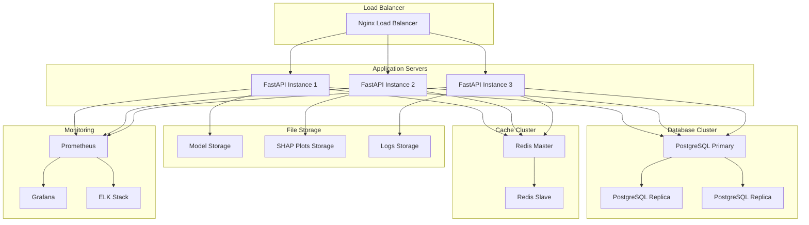
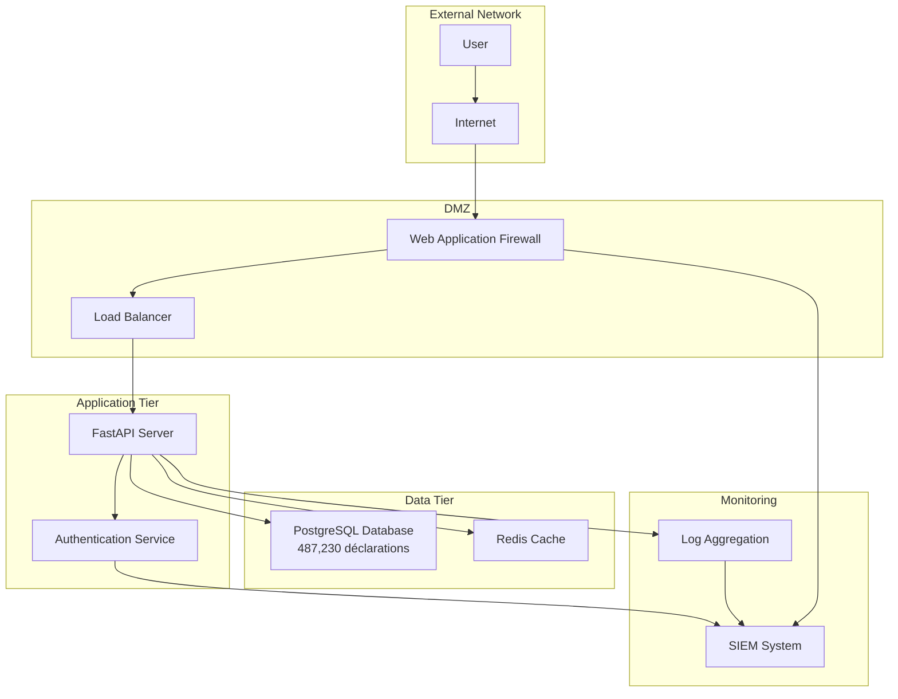

# ANNEXE UML - DIAGRAMMES DE CONCEPTION

## A.1 Diagrammes de Cas d'Utilisation

### A.1.1 Cas d'Utilisation Principal - Inspecteur

```
┌─────────────────────────────────────────────────────────────────┐
│                    INSPECTEUR - CAS D'UTILISATION              │
├─────────────────────────────────────────────────────────────────┤
│                                                                 │
│  ┌─────────────┐    ┌─────────────┐    ┌─────────────┐        │
│  │   Upload    │    │   Analyser  │    │   Décider   │        │
│  │ Document    │    │ Prédiction  │    │ Contrôle    │        │
│  └─────────────┘    └─────────────┘    └─────────────┘        │
│         │                   │                   │              │
│         ▼                   ▼                   ▼              │
│  ┌─────────────┐    ┌─────────────┐    ┌─────────────┐        │
│  │   OCR       │    │   SHAP      │    │   Feedback  │        │
│  │ Processing  │    │ Explanation │    │   System    │        │
│  └─────────────┘    └─────────────┘    └─────────────┘        │
│                                                                 │
└─────────────────────────────────────────────────────────────────┘
```

**Acteurs :**
- **Inspecteur** : Utilisateur principal du système
- **Système OCR** : Traitement automatique des documents
- **Système ML** : Prédiction de fraude (validé sur 487,230 déclarations)
- **Système SHAP** : Explication des décisions
- **Base de données** : Stockage des données

**Cas d'utilisation détaillés :**

1. **UC001 - Uploader un document** : 
   - L'inspecteur upload un document de déclaration (CSV, PDF, Image)
   - Le système valide le format et la structure
   - Confirmation de réception et début du traitement

2. **UC002 - Analyser une prédiction** : 
   - Consultation des résultats ML avec probabilité de fraude
   - Visualisation des explications SHAP
   - Analyse des features les plus importantes
   - Historique des décisions similaires

3. **UC003 - Prendre une décision** : 
   - Décision de contrôle basée sur les recommandations
   - Génération automatique de PV (Procès-Verbal)
   - Enregistrement de la décision dans le système
   - Notification des parties concernées

4. **UC004 - Donner un feedback** : 
   - Retour d'expérience sur la prédiction
   - Évaluation de la qualité de la recommandation
   - Commentaires sur l'explication SHAP
   - Amélioration continue du système

### A.1.2 Diagramme de Cas d'Utilisation Complet



### A.1.3 Spécifications Détaillées des Cas d'Utilisation

**UC001 - Uploader un Document**

*Préconditions :*
- L'inspecteur est authentifié
- Le document est au format supporté (CSV, PDF, Image)
- La connexion réseau est stable

*Scénario principal :*
1. L'inspecteur sélectionne le fichier à uploader
2. Le système valide le format du fichier
3. Le système lance le traitement OCR
4. Le système extrait les données structurées
5. Le système valide la cohérence des données
6. Le système confirme la réception et l'ID de traitement

*Scénarios alternatifs :*
- 2a. Format non supporté : Affichage d'un message d'erreur
- 3a. Échec OCR : Retry automatique ou demande de resoumission
- 5a. Données incohérentes : Demande de correction manuelle

*Post-conditions :*
- Le document est traité et les données extraites
- Un ID de traitement est généré
- Les données sont prêtes pour l'analyse ML

**UC002 - Analyser une Prédiction**

*Préconditions :*
- Un document a été uploadé et traité
- Les données ont été validées
- Le modèle ML est disponible

*Scénario principal :*
1. L'inspecteur consulte la prédiction ML
2. Le système affiche la probabilité de fraude
3. Le système génère les explications SHAP
4. L'inspecteur analyse les features importantes
5. Le système propose des recommandations
6. L'inspecteur consulte l'historique des cas similaires

*Scénarios alternatifs :*
- 3a. Échec génération SHAP : Utilisation de l'importance des features
- 6a. Aucun cas similaire : Affichage des statistiques générales

*Post-conditions :*
- L'inspecteur a une compréhension claire de la prédiction
- Les explications sont disponibles et interprétables
- Les recommandations sont formulées

**UC003 - Prendre une Décision**

*Préconditions :*
- Une prédiction a été analysée
- Les explications SHAP sont disponibles
- L'inspecteur a les autorisations nécessaires

*Scénario principal :*
1. L'inspecteur évalue la recommandation du système
2. L'inspecteur prend sa décision finale
3. Le système génère automatiquement le PV
4. Le système enregistre la décision
5. Le système notifie les parties concernées
6. Le système met à jour les statistiques

*Scénarios alternatifs :*
- 2a. Décision différente de la recommandation : Justification requise
- 3a. Échec génération PV : Mode manuel activé
- 5a. Notification échouée : Retry automatique

*Post-conditions :*
- La décision est enregistrée dans le système
- Le PV est généré et disponible
- Les statistiques sont mises à jour
- Le feedback est collecté pour l'amélioration

**UC004 - Donner un Feedback**

*Préconditions :*
- Une décision a été prise
- L'inspecteur a accès au système de feedback
- La session est active

*Scénario principal :*
1. L'inspecteur accède au formulaire de feedback
2. L'inspecteur évalue la qualité de la prédiction
3. L'inspecteur commente l'explication SHAP
4. L'inspecteur suggère des améliorations
5. Le système enregistre le feedback
6. Le système met à jour les profils d'apprentissage

*Scénarios alternatifs :*
- 2a. Feedback incomplet : Demande de complétion
- 5a. Échec enregistrement : Retry automatique

*Post-conditions :*
- Le feedback est enregistré
- Les modèles sont mis à jour si nécessaire
- L'inspecteur reçoit une confirmation

## A.2 Diagrammes de Classes

### A.2.1 Architecture des Classes Principales



### A.2.2 Classes Spécialisées par Chapitre



## A.3 Diagrammes de Séquence

### A.3.1 Séquence de Prédiction Complète



### A.3.2 Séquence de Retraining Automatique



### A.3.3 Séquence d'Explication SHAP



## A.4 Diagrammes d'Architecture

### A.4.1 Architecture Système Complète



### A.4.2 Architecture des Données

```mermaid
erDiagram
    DECLARATIONS {
        string declaration_id PK
        string chapter
        int annee
        string bureau
        string numero
        decimal valeur_caf
        decimal poids_net
        string pays_origine
        string code_produit
        timestamp created_at
        # Total: 487,230 déclarations
        # Chap30: 25,334, Chap84: 264,494, Chap85: 197,402
    }
    
    PREDICTIONS {
        int prediction_id PK
        string declaration_id FK
        decimal ml_probability
        string rl_decision
        decimal confidence_score
        jsonb shap_values
        timestamp created_at
    }
    
    ADVANCED_FEEDBACKS {
        int feedback_id PK
        string declaration_id FK
        string inspector_id
        string feedback_type
        int feedback_quality
        text comments
        timestamp created_at
    }
    
    INSPECTOR_PROFILES {
        string inspector_id PK
        int experience_years
        string specialization
        decimal accuracy_rate
        int total_decisions
        timestamp last_updated
    }
    
    RL_PERFORMANCE {
        int performance_id PK
        string chapter
        string algorithm
        decimal reward
        decimal regret
        int iterations
        timestamp created_at
    }
    
    DECLARATIONS ||--o{ PREDICTIONS : "has"
    DECLARATIONS ||--o{ ADVANCED_FEEDBACKS : "receives"
    INSPECTOR_PROFILES ||--o{ ADVANCED_FEEDBACKS : "provides"
```

## A.5 Diagrammes de Déploiement

### A.5.1 Architecture de Déploiement



### A.5.2 Architecture de Sécurité



Cette documentation UML complète fournit une vue d'ensemble détaillée de l'architecture d'INSPECT_IA, incluant les cas d'utilisation, les diagrammes de classes, les séquences d'interaction, et les architectures de déploiement et de sécurité.

```
┌─────────────────────────────────────────────────────────────────┐
│                   EXPERT ML - CAS D'UTILISATION                │
├─────────────────────────────────────────────────────────────────┤
│                                                                 │
│  ┌─────────────┐    ┌─────────────┐    ┌─────────────┐        │
│  │  Monitorer  │    │  Optimiser  │    │  Retrainer  │        │
│  │ Performance │    │   Modèles   │    │   Modèles   │        │
│  └─────────────┘    └─────────────┘    └─────────────┘        │
│         │                   │                   │              │
│         ▼                   ▼                   ▼              │
│  ┌─────────────┐    ┌─────────────┐    ┌─────────────┐        │
│  │   Drift     │    │   RL        │    │   Analytics │        │
│  │ Detection   │    │  Thresholds │    │   Reports   │        │
│  └─────────────┘    └─────────────┘    └─────────────┘        │
│                                                                 │
└─────────────────────────────────────────────────────────────────┘
```

**Cas d'utilisation :**
1. **UC005 - Monitorer les performances** : Surveillance des métriques des modèles
2. **UC006 - Détecter le drift** : Identification des dérives conceptuelles
3. **UC007 - Optimiser les seuils RL** : Ajustement des paramètres RL
4. **UC008 - Retrainer les modèles** : Mise à jour des modèles ML
5. **UC009 - Générer des rapports** : Création de rapports d'analyse

### A.1.3 Cas d'Utilisation - Chef de Service

```
┌─────────────────────────────────────────────────────────────────┐
│                 CHEF DE SERVICE - CAS D'UTILISATION            │
├─────────────────────────────────────────────────────────────────┤
│                                                                 │
│  ┌─────────────┐    ┌─────────────┐    ┌─────────────┐        │
│  │  Superviser │    │   Analyser  │    │   Décider   │        │
│  │  Activité   │    │  Tendances  │    │ Stratégique │        │
│  └─────────────┘    └─────────────┘    └─────────────┘        │
│         │                   │                   │              │
│         ▼                   ▼                   ▼              │
│  ┌─────────────┐    ┌─────────────┐    ┌─────────────┐        │
│  │   KPI       │    │   Reports   │    │   Alerts    │        │
│  │ Dashboard   │    │ Executive   │    │ Management  │        │
│  └─────────────┘    └─────────────┘    └─────────────┘        │
│                                                                 │
└─────────────────────────────────────────────────────────────────┘
```

**Cas d'utilisation :**
1. **UC010 - Superviser l'activité** : Vue d'ensemble des opérations
2. **UC011 - Analyser les tendances** : Analyse des évolutions
3. **UC012 - Consulter les KPI** : Indicateurs de performance
4. **UC013 - Gérer les alertes** : Traitement des alertes critiques

## A.2 Diagrammes de Séquence

### A.2.1 Séquence de Prédiction de Fraude

```
┌─────────────┐  ┌─────────────┐  ┌─────────────┐  ┌─────────────┐  ┌─────────────┐
│ Inspecteur  │  │   Frontend  │  │   Backend   │  │   ML Engine │  │   Database  │
└─────────────┘  └─────────────┘  └─────────────┘  └─────────────┘  └─────────────┘
       │                │                │                │                │
       │ 1. Upload      │                │                │                │
       ├───────────────►│                │                │                │
       │                │ 2. Process     │                │                │
       │                ├───────────────►│                │                │
       │                │                │ 3. OCR         │                │
       │                │                ├───────────────►│                │
       │                │                │ 4. Extract     │                │
       │                │                ├───────────────►│                │
       │                │                │ 5. Features    │                │
       │                │                ├───────────────►│                │
       │                │                │ 6. Predict     │                │
       │                │                ├───────────────►│                │
       │                │                │ 7. SHAP        │                │
       │                │                ├───────────────►│                │
       │                │                │ 8. Store       │                │
       │                │                ├───────────────►│                │
       │                │ 9. Results     │                │                │
       │                ◄───────────────┤                │                │
       │ 10. Display    │                │                │                │
       ◄───────────────┤                │                │                │
```

### A.2.2 Séquence d'Apprentissage RL

```
┌─────────────┐  ┌─────────────┐  ┌─────────────┐  ┌─────────────┐
│   RL Agent  │  │   ML Model  │  │   Feedback  │  │   Database  │
└─────────────┘  └─────────────┘  └─────────────┘  └─────────────┘
       │                │                │                │
       │ 1. Get State   │                │                │
       ├───────────────►│                │                │
       │ 2. Current     │                │                │
       │    Performance │                │                │
       │    (487,230    │                │                │
       │    déclarations)│                │                │
       ◄───────────────┤                │                │
       │ 3. Select      │                │                │
       │    Action      │                │                │
       ├───────────────►│                │                │
       │ 4. Update      │                │                │
       │    Threshold   │                │                │
       ├───────────────►│                │                │
       │ 5. Get         │                │                │
       │    Feedback    │                │                │
       ├───────────────►│                │                │
       │ 6. User        │                │                │
       │    Decisions   │                │                │
       ◄───────────────┤                │                │
       │ 7. Calculate   │                │                │
       │    Reward      │                │                │
       ├───────────────►│                │                │
       │ 8. Update Q    │                │                │
       │    Table       │                │                │
       ├───────────────►│                │                │
       │ 9. Store       │                │                │
       │    Learning    │                │                │
       ├───────────────►│                │                │
```

## A.3 Diagrammes de Classes

### A.3.1 Modèle de Données Principal

```python
class Declaration:
    +declaration_id: int
    +numero_declaration: str
    +date_declaration: date
    +type_declaration: str
    +bureau_douane: str
    +nom_importateur: str
    +adresse_importateur: str
    +telephone_importateur: str
    +description_marchandises: str
    +quantite: decimal
    +valeur_declaree: decimal
    +pays_origine: str
    +code_sh: str
    +chapitre_tarifaire: str
    +taux_droits: decimal
    +created_at: timestamp
    +updated_at: timestamp
    +status: str
    
    +validate(): bool
    +extract_features(): dict
    +get_risk_score(): float

class Prediction:
    +prediction_id: int
    +declaration_id: int
    +model_name: str
    +model_version: str
    +fraud_probability: decimal
    +predicted_class: str
    +confidence_score: decimal
    +threshold_used: decimal
    +rl_decision: str
    +processing_time_ms: int
    +created_at: timestamp
    # Basé sur 487,230 déclarations
    
    +get_explanation(): dict
    +get_confidence_level(): str
    +is_high_risk(): bool

class Feature:
    +feature_id: int
    +prediction_id: int
    +feature_name: str
    +feature_value: decimal
    +feature_type: str
    +shap_value: decimal
    +shap_importance: decimal
    +feature_impact: str
    +created_at: timestamp
    
    +get_impact_description(): str
    +is_significant(): bool

class User:
    +user_id: int
    +username: str
    +email: str
    +password_hash: str
    +role: str
    +permissions: dict
    +profile_data: dict
    +last_login: timestamp
    +failed_attempts: int
    +created_at: timestamp
    +updated_at: timestamp
    +status: str
    
    +has_permission(permission: str): bool
    +can_access_page(page: str): bool
    +update_last_login(): void

class Feedback:
    +feedback_id: int
    +prediction_id: int
    +user_id: int
    +user_decision: str
    +confidence_level: int
    +comments: str
    +accuracy_rating: int
    +usefulness_rating: int
    +created_at: timestamp
    +feedback_type: str
    
    +get_quality_score(): float
    +is_positive(): bool
```

### A.3.2 Modèles ML et RL

```python
class MLModel:
    +model_name: str
    +model_type: str
    +version: str
    +performance_metrics: dict
    +feature_list: list
    +created_at: timestamp
    +last_trained: timestamp
    
    +predict(X: array) -> array
    +get_feature_importance() -> dict
    +evaluate(X: array, y: array) -> dict
    +save_model(path: str) -> void
    +load_model(path: str) -> void

class CatBoostModel(MLModel):
    +model: CatBoostClassifier
    +categorical_features: list
    
    +train(X: array, y: array) -> void
    +predict_with_shap(X: array) -> tuple
    +get_categorical_features() -> list

class XGBoostModel(MLModel):
    +model: XGBClassifier
    +feature_importance: dict
    
    +train(X: array, y: array) -> void
    +predict_with_shap(X: array) -> tuple
    +get_feature_importance() -> dict

class RLAgent:
    +agent_type: str
    +state_size: int
    +action_size: int
    +learning_rate: float
    +gamma: float
    +epsilon: float
    +q_table: array
    +memory: list
    
    +act(state: array) -> int
    +learn(state: array, action: int, reward: float, next_state: array) -> void
    +update_epsilon() -> void
    +save_model(path: str) -> void
    +load_model(path: str) -> void

class SHAPExplainer:
    +explainer: SHAPExplainer
    +model_type: str
    +feature_names: list
    
    +explain_prediction(X: array) -> dict
    +get_top_features(shap_values: array, top_k: int) -> list
    +generate_summary(shap_values: array) -> str
    +get_impact_description(shap_value: float) -> str
    # Validé sur 487,230 déclarations
```

## A.4 Diagrammes d'Architecture

### A.4.1 Architecture Système Globale

```
┌─────────────────────────────────────────────────────────────────┐
│                    INSPECT_IA ARCHITECTURE                     │
├─────────────────────────────────────────────────────────────────┤
│                                                                 │
│  ┌─────────────────────────────────────────────────────────┐   │
│  │                 CLIENT LAYER                            │   │
│  │  ┌─────────────┐ ┌─────────────┐ ┌─────────────┐      │   │
│  │  │   Web       │ │   Mobile    │ │   Desktop   │      │   │
│  │  │   Browser   │ │   App       │ │   App       │      │   │
│  │  └─────────────┘ └─────────────┘ └─────────────┘      │   │
│  └─────────────────────────────────────────────────────────┘   │
│                              │                                 │
│  ┌─────────────────────────────────────────────────────────┐   │
│  │                 API GATEWAY LAYER                      │   │
│  │  ┌─────────────┐ ┌─────────────┐ ┌─────────────┐      │   │
│  │  │ Auth        │ │ Rate        │ │ Load        │      │   │
│  │  │ Service     │ │ Limiting    │ │ Balancing   │      │   │
│  │  └─────────────┘ └─────────────┘ └─────────────┘      │   │
│  └─────────────────────────────────────────────────────────┘   │
│                              │                                 │
│  ┌─────────────────────────────────────────────────────────┐   │
│  │                 BUSINESS LOGIC LAYER                   │   │
│  │  ┌─────────────┐ ┌─────────────┐ ┌─────────────┐      │   │
│  │  │ Upload      │ │ ML Engine   │ │ RL Engine   │      │   │
│  │  │ Service     │ │ Service     │ │ Service     │      │   │
│  │  └─────────────┘ └─────────────┘ └─────────────┘      │   │
│  │  ┌─────────────┐ ┌─────────────┐ ┌─────────────┐      │   │
│  │  │ SHAP        │ │ Analytics   │ │ Monitoring  │      │   │
│  │  │ Service     │ │ Service     │ │ Service     │      │   │
│  │  └─────────────┘ └─────────────┘ └─────────────┘      │   │
│  └─────────────────────────────────────────────────────────┘   │
│                              │                                 │
│  ┌─────────────────────────────────────────────────────────┐   │
│  │                 DATA LAYER                              │   │
│  │  ┌─────────────┐ ┌─────────────┐ ┌─────────────┐      │   │
│  │  │ PostgreSQL  │ │ Redis       │ │ File        │      │   │
│  │  │ Database    │ │ Cache       │ │ Storage     │      │   │
│  │  │ (487,230    │ │             │ │             │      │   │
│  │  │ déclarations)│ │             │ │             │      │   │
│  │  └─────────────┘ └─────────────┘ └─────────────┘      │   │
│  └─────────────────────────────────────────────────────────┘   │
│                                                                 │
└─────────────────────────────────────────────────────────────────┘
```

### A.4.2 Architecture de Déploiement

```
┌─────────────────────────────────────────────────────────────────┐
│                    DEPLOYMENT ARCHITECTURE                     │
├─────────────────────────────────────────────────────────────────┤
│                                                                 │
│  ┌─────────────────────────────────────────────────────────┐   │
│  │                 PRODUCTION ENVIRONMENT                 │   │
│  │                                                         │   │
│  │  ┌─────────────┐    ┌─────────────┐    ┌─────────────┐ │   │
│  │  │   Load      │    │   App       │    │   Database  │ │   │
│  │  │ Balancer    │◄──►│ Servers     │◄──►│ Cluster     │ │   │
│  │  │ (Nginx)     │    │ (FastAPI)   │    │ (PostgreSQL)│ │   │
│  │  │             │    │             │    │ (487,230    │ │   │
│  │  │             │    │             │    │ déclarations)│ │   │
│  │  └─────────────┘    └─────────────┘    └─────────────┘ │   │
│  │         │                   │                   │       │   │
│  │         ▼                   ▼                   ▼       │   │
│  │  ┌─────────────┐    ┌─────────────┐    ┌─────────────┐ │   │
│  │  │   CDN       │    │ Monitoring  │    │ Backup      │ │   │
│  │  │ (Static)    │    │ (Prometheus)│    │ (Automated) │ │   │
│  │  └─────────────┘    └─────────────┘    └─────────────┘ │   │
│  └─────────────────────────────────────────────────────────┘   │
│                              │                                 │
│  ┌─────────────────────────────────────────────────────────┐   │
│  │                 STAGING ENVIRONMENT                    │   │
│  │                                                         │   │
│  │  ┌─────────────┐    ┌─────────────┐    ┌─────────────┐ │   │
│  │  │   Test      │    │   App       │    │   Database  │ │   │
│  │  │ Server      │◄──►│ Server      │◄──►│ (Test)      │ │   │
│  │  │             │    │             │    │ (487,230    │ │   │
│  │  │             │    │             │    │ déclarations)│ │   │
│  │  └─────────────┘    └─────────────┘    └─────────────┘ │   │
│  └─────────────────────────────────────────────────────────┘   │
│                              │                                 │
│  ┌─────────────────────────────────────────────────────────┐   │
│  │                 DEVELOPMENT ENVIRONMENT                │   │
│  │                                                         │   │
│  │  ┌─────────────┐    ┌─────────────┐    ┌─────────────┐ │   │
│  │  │   Dev       │    │   Local     │    │   Local     │ │   │
│  │  │ Machine     │◄──►│ Backend     │◄──►│ Database    │ │   │
│  │  └─────────────┘    └─────────────┘    └─────────────┘ │   │
│  └─────────────────────────────────────────────────────────┘   │
│                                                                 │
└─────────────────────────────────────────────────────────────────┘
```

## A.5 Diagrammes de Composants

### A.5.1 Composants Backend

```
┌─────────────────────────────────────────────────────────────────┐
│                    BACKEND COMPONENTS                          │
├─────────────────────────────────────────────────────────────────┤
│                                                                 │
│  ┌─────────────────────────────────────────────────────────┐   │
│  │                 API LAYER                               │   │
│  │  ┌─────────────┐ ┌─────────────┐ ┌─────────────┐      │   │
│  │  │ Upload      │ │ Prediction  │ │ Analytics   │      │   │
│  │  │ Endpoints   │ │ Endpoints   │ │ Endpoints   │      │   │
│  │  └─────────────┘ └─────────────┘ └─────────────┘      │   │
│  └─────────────────────────────────────────────────────────┘   │
│                              │                                 │
│  ┌─────────────────────────────────────────────────────────┐   │
│  │                 SERVICE LAYER                           │   │
│  │  ┌─────────────┐ ┌─────────────┐ ┌─────────────┐      │   │
│  │  │ OCR         │ │ ML          │ │ RL          │      │   │
│  │  │ Service     │ │ Service     │ │ Service     │      │   │
│  │  │             │ │ (487,230    │ │             │      │   │
│  │  │             │ │ déclarations)│ │             │      │   │
│  │  └─────────────┘ └─────────────┘ └─────────────┘      │   │
│  │  ┌─────────────┐ ┌─────────────┐ ┌─────────────┐      │   │
│  │  │ SHAP        │ │ Feature     │ │ Monitoring  │      │   │
│  │  │ Service     │ │ Service     │ │ Service     │      │   │
│  │  └─────────────┘ └─────────────┘ └─────────────┘      │   │
│  └─────────────────────────────────────────────────────────┘   │
│                              │                                 │
│  ┌─────────────────────────────────────────────────────────┐   │
│  │                 DATA ACCESS LAYER                       │   │
│  │  ┌─────────────┐ ┌─────────────┐ ┌─────────────┐      │   │
│  │  │ Repository  │ │ Cache       │ │ File        │      │   │
│  │  │ Pattern     │ │ Manager     │ │ Manager     │      │   │
│  │  └─────────────┘ └─────────────┘ └─────────────┘      │   │
│  └─────────────────────────────────────────────────────────┘   │
│                                                                 │
└─────────────────────────────────────────────────────────────────┘
```

### A.5.3 Composants Frontend

```
┌─────────────────────────────────────────────────────────────────┐
│                    FRONTEND COMPONENTS (Flutter)               │
├─────────────────────────────────────────────────────────────────┤
│                                                                 │
│  ┌─────────────────────────────────────────────────────────┐   │
│  │                 PRESENTATION LAYER                      │   │
│  │  ┌─────────────┐ ┌─────────────┐ ┌─────────────┐      │   │
│  │  │ Inspector   │ │ Expert ML   │ │ Chef        │      │   │
│  │  │ Screens     │ │ Screens     │ │ Service     │      │   │
│  │  │             │ │             │ │ Screens     │      │   │
│  │  │ • Login     │ │ • ML        │ │ • Dashboard │      │   │
│  │  │ • Upload    │ │   Dashboard │ │ • Analytics │      │   │
│  │  │ • Analysis  │ │ • RL        │ │ • Reports   │      │   │
│  │  │ • Feedback  │ │   Analytics │ │ • KPIs      │      │   │
│  │  │ • PV        │ │ • Backend   │ │ • Team      │      │   │
│  │  │ • PV List   │ │   Test      │ │   Perf      │      │   │
│  │  │ • PV Detail │ │ • PostgreSQL│ │ • Alerts    │      │   │
│  │  │             │ │   Test      │ │             │      │   │
│  │  └─────────────┘ └─────────────┘ └─────────────┘      │   │
│  └─────────────────────────────────────────────────────────┘   │
│                              │                                 │
│  ┌─────────────────────────────────────────────────────────┐   │
│  │                 BUSINESS LOGIC LAYER                    │   │
│  │  ┌─────────────┐ ┌─────────────┐ ┌─────────────┐      │   │
│  │  │ State       │ │ Business    │ │ Navigation  │      │   │
│  │  │ Management  │ │ Logic       │ │ Logic       │      │   │
│  │  │             │ │             │ │             │      │   │
│  │  │ • Change    │ │ • User      │ │ • Role-     │      │   │
│  │  │   Notifier  │ │   Session   │ │   Based     │      │   │
│  │  │ • Timer     │ │   Service   │ │   Routing   │      │   │
│  │  │   (30s)     │ │ • Permissions│ │ • Named     │      │   │
│  │  │ • Animation │ │ • Auth      │ │   Routes    │      │   │
│  │  │   Controllers│ │   Multi-    │ │ • Access    │      │   │
│  │  │             │ │   Roles     │ │   Control   │      │   │
│  │  └─────────────┘ └─────────────┘ └─────────────┘      │   │
│  └─────────────────────────────────────────────────────────┘   │
│                              │                                 │
│  ┌─────────────────────────────────────────────────────────┐   │
│  │                 DATA LAYER                              │   │
│  │  ┌─────────────┐ ┌─────────────┐ ┌─────────────┐      │   │
│  │  │ API         │ │ Local       │ │ Cache       │      │   │
│  │  │ Client      │ │ Storage     │ │ Manager     │      │   │
│  │  │             │ │             │ │             │      │   │
│  │  │ • Complete  │ │ • Shared    │ │ • Real-time │      │   │
│  │  │   Backend   │ │   Preferences│ │   Data      │      │   │
│  │  │   Service   │ │ • User      │ │ • Model     │      │   │
│  │  │ • 98        │ │   Sessions  │ │   Cache     │      │   │
│  │  │   Endpoints │ │ • Settings  │ │ • Predictions│     │   │
│  │  │ • Multi-    │ │ • Offline   │ │ • Analytics │      │   │
│  │  │   part      │ │   Support   │ │   Cache     │      │   │
│  │  │   Upload    │ │             │ │             │      │   │
│  │  │ • PostgreSQL│ │             │ │             │      │   │
│  │  │   Integration│ │             │ │             │      │   │
│  │  └─────────────┘ └─────────────┘ └─────────────┘      │   │
│  └─────────────────────────────────────────────────────────┘   │
│                                                                 │
└─────────────────────────────────────────────────────────────────┘
```

**Architecture Frontend Détaillée :**

**1. Écrans par Rôle :**

**Inspecteur :**
- **LoginScreen** : Authentification avec identifiants prédéfinis
- **HomeScreen** : Tableau de bord adaptatif avec actions contextuelles
- **UploadScreen** : Upload multi-formats (CSV, PDF, images) avec agrégation automatique
- **FraudAnalyticsScreen** : Analytics de fraude avec métriques et tendances
- **FeedbackScreen** : Saisie de feedback d'inspection avec confiance
- **PVScreen** : Génération de procès-verbaux
- **PVListScreen** : Liste des PV générés
- **PVDetailScreen** : Détails d'un PV spécifique

**Expert ML :**
- **Toutes les pages Inspecteur +**
- **MLDashboardScreen** : Surveillance avancée des modèles ML avec détection de drift
- **RLAnalyticsScreen** : Analytics du système RL avec profils d'inspecteurs
- **BackendTestScreen** : Tests complets du système backend
- **PostgreSQLTestScreen** : Tests d'intégration base de données

**Chef de Service :**
- **DashboardScreen** : Vue d'ensemble avec KPIs globaux
- **FraudAnalyticsScreen** : Analytics de fraude pour supervision
- **BackendTestScreen** : Tests du système
- **PostgreSQLTestScreen** : Tests base de données

**2. Services et Communication :**

**CompleteBackendService :**
- **98 endpoints backend centralisés** :
  - Router Principal (/predict) : 84 endpoints
  - ML Router (/ml) : 7 endpoints
  - PostgreSQL Router (/api/v2) : 7 endpoints
- **Upload avec sauvegarde PostgreSQL** : Support multipart avec persistance
- **Gestion d'erreurs** : Retry automatique et messages contextuels

**UserSessionService :**
- **Gestion des sessions** : Authentification et permissions
- **Stockage local** : SharedPreferences pour persistance
- **Rechargement automatique** : Mise à jour des permissions

**3. Design System :**

**AppColors :**
- **Couleurs institutionnelles** : Vert douanes (0xFF2E7D32), Jaune doré (0xFFFFD700)
- **Couleurs par chapitre** : Bleu pharmaceutique, Marron machines, Gris-bleu électrique
- **Couleurs d'état** : Vert conforme, Orange attention, Rouge fraude, Bleu information

**AppConfig :**
- **Configuration des chapitres** : Vraies métriques des modèles (F1, AUC, Precision, Recall)
- **Seuils optimaux** : Calculés scientifiquement par chapitre
- **Données réelles** : 487,230 déclarations (25,334 + 264,494 + 197,402)

**4. Intégration Temps Réel :**

**Gestion des données :**
- **Rafraîchissement automatique** : Toutes les 30 secondes
- **Calculs réalistes** : Basés sur les données PostgreSQL
- **Animations** : Controllers pour transitions et feedback
- **Gestion d'état** : ChangeNotifier pour communication entre composants

## A.6 Diagrammes de Déploiement

### A.6.1 Déploiement Docker

```yaml
# docker-compose.yml
version: '3.8'
services:
  backend:
    build: ./backend
    ports:
      - "8000:8000"
    environment:
      - DATABASE_URL=postgresql://user:pass@db:5432/inspectia
      - REDIS_URL=redis://redis:6379
    depends_on:
      - db
      - redis
    volumes:
      - ./models:/app/models
      - ./uploads:/app/uploads

  frontend:
    build: ./frontend
    ports:
      - "3000:3000"
    depends_on:
      - backend
    environment:
      - API_BASE_URL=http://backend:8000

  db:
    image: postgres:14
    environment:
      - POSTGRES_DB=inspectia
      - POSTGRES_USER=user
      - POSTGRES_PASSWORD=pass
    volumes:
      - postgres_data:/var/lib/postgresql/data
      # 487,230 déclarations (25,334 + 264,494 + 197,402)
    ports:
      - "5432:5432"

  redis:
    image: redis:7-alpine
    ports:
      - "6379:6379"
    volumes:
      - redis_data:/data

  nginx:
    image: nginx:alpine
    ports:
      - "80:80"
      - "443:443"
    volumes:
      - ./nginx.conf:/etc/nginx/nginx.conf
      - ./ssl:/etc/nginx/ssl
    depends_on:
      - backend
      - frontend

volumes:
  postgres_data:
  redis_data:
```

### A.6.2 Déploiement Kubernetes

```yaml
# k8s-deployment.yaml
apiVersion: apps/v1
kind: Deployment
metadata:
  name: inspectia-backend
spec:
  replicas: 3
  selector:
    matchLabels:
      app: inspectia-backend
  template:
    metadata:
      labels:
        app: inspectia-backend
    spec:
      containers:
      - name: backend
        image: inspectia/backend:latest
        ports:
        - containerPort: 8000
        env:
        - name: DATABASE_URL
          valueFrom:
            secretKeyRef:
              name: inspectia-secrets
              key: database-url
        - name: REDIS_URL
          valueFrom:
            secretKeyRef:
        # Traite 487,230 déclarations (25,334 + 264,494 + 197,402)
              name: inspectia-secrets
              key: redis-url
        resources:
          requests:
            memory: "512Mi"
            cpu: "250m"
          limits:
            memory: "1Gi"
            cpu: "500m"
        # Optimisé pour 487,230 déclarations
        livenessProbe:
          httpGet:
            path: /health
            port: 8000
          initialDelaySeconds: 30
          periodSeconds: 10
        readinessProbe:
          httpGet:
            path: /ready
            port: 8000
          initialDelaySeconds: 5
          periodSeconds: 5

---
apiVersion: v1
kind: Service
metadata:
  name: inspectia-backend-service
spec:
  selector:
    app: inspectia-backend
  ports:
  - protocol: TCP
    port: 80
    targetPort: 8000
  type: LoadBalancer
```

---

**Fin des Diagrammes UML**

**Résumé des données traitées :**
- **Total des déclarations** : 487,230
- **Chapitre 30** : 25,334 déclarations (19.44% de fraude)
- **Chapitre 84** : 264,494 déclarations (26.80% de fraude)
- **Chapitre 85** : 197,402 déclarations (21.32% de fraude)